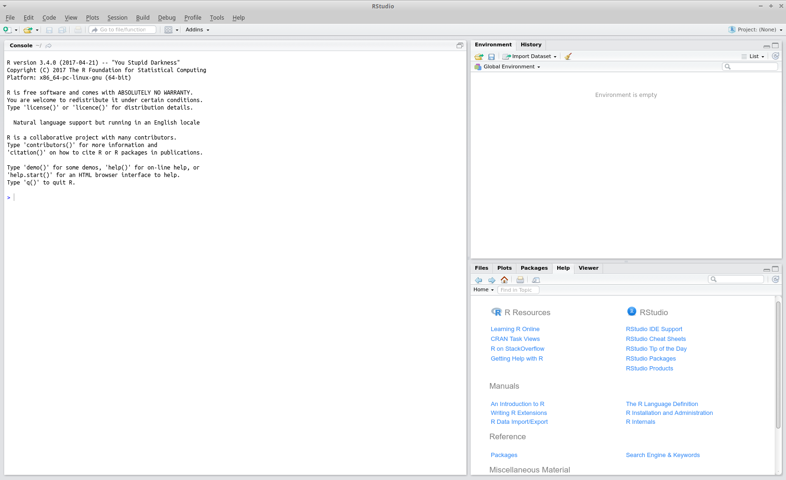

```{r setup, include=FALSE}
knitr::opts_chunk$set(echo = TRUE)
knitr::opts_chunk$set(
  tidy=FALSE,     # display code as typed
  size="small"    # slightly smaller font for code
)
```

## Vorbereitungen und Hinweise
Während der gesamten Installation sollten Sie eine stabile Internetverbindung haben. Laptops (insbesondere Macbooks) sollten am Stromnetz angeschlossen sein. Für die Installation müssen Sie ein wenig Zeit einplanen, der Aufwand ist aber nur einmalig nötig! Bitte beachten Sie diese Hinweise. Bei Problemen können Sie sich, bitte mit einer möglichst genauen Beschreibung (z. B. Fehlermeldung, Betriebssystem etc.) an <R@fom.de> wenden.

* [**R**](https://www.r-project.org/) ist das Basisprogramm
* [**RStudio (Desktop)**](https://www.rstudio.com/) ist eine komfortable Entwicklungsumgebung für R und bietet zusätzliche Tools, wie z. B. Dokumentenerstellung etc.
* [**mosaic**](https://cran.r-project.org/web/packages/mosaic/) ist ein Zusatzpaket, welches u. a. eine vereinheitlichte R Syntax bietet


### Windows
Sie müssen *keine* Administrationsrechte besitzen um R und R Studio installieren zu können. Sie können in Ihr lokales Verzeichnis oder aber auch z. B. auf einen USB-Stick installieren. 

### macOS
Neuere Versionen von R werden nur noch für OS X/macOS ab Version 10.11 oder neuer zur Verfügung gestellt. Apple unterstützt (ganz) alte Version nicht mehr. Daher lohnt sich auch aus Sicherheitsgründen und aus R-gründen eine Aktualisierung auf macOS Sierra: [https://www.apple.com/de/macos/how-to-upgrade/](https://www.apple.com/de/macos/how-to-upgrade/). 

Einige Zusatzpakete benötigen das X11 Windows System. Dies muss vorab – sofern noch nicht vorhanden – von der Seite [https://www.xquartz.org/](https://www.xquartz.org/) installiert werden. Nach der Installation muss der Computer neu gestartet werden.

Sollten Sie bei der Installation oder nach Start von R oder RStudio gefragt werden, ob Sie [`XCode`](https://itunes.apple.com/us/app/xcode/id497799835?mt=12) (`Command Line Tool`) installieren wollen dies bitte tun.

1. Installation XQuartz
2. Neustart Computer
3. Fortfahren mit der Installation von R


## Installation 
Installieren Sie zunächst R und anschließend RStudio Desktop.

### Installation von R
Installieren Sie die für Ihr System aktuelle Version von R von der Seite 

[https://www.r-project.org/](https://www.r-project.org/). 

Welchen "Mirror" (Server) Sie verwenden ist dabei egal, z. B. den Cloud Mirror von R Studio:

1.  Windows: [https://cran.rstudio.com/bin/windows/base/](https://cran.rstudio.com/bin/windows/base/)
2.  macOS: [https://cran.rstudio.com/bin/macosx/](https://cran.rstudio.com/bin/macosx/)

Sie können in der Regel die Standardeinstellungen innerhalb der Installation verwenden.

### Installation von RStudio (Desktop)
Sie können R-Studio (Desktop-Version) von der Seite

[https://www.rstudio.com/products/rstudio/download/](https://www.rstudio.com/products/rstudio/download/)

entsprechend Ihrem Betriebssystem herunterladen und anschließend installieren.

*Hinweis macOS*: Sollten Sie bei der Installation oder nach Start von R oder RStudio gefragt werden, ob Sie `XCode` (`Command Line Tool`) installieren wollen dies bitte tun.


### Installation von Zusatzpaketen

Die Grundinstallation ist jetzt abgeschlossen. RStudio erkennt in der Regel automatisch R, und Sie können beides durch klicken auf das Programm bzw. das Icon mit dem Logo von RStudio  starten. (Die ausführbare Datei finden Sie dabei im Ordner `bin` des Verzeichnisses, indem Sie RStudio installiert haben.) Wenn Sie nur R starten wollen, klicken Sie entsprechend auf das Icon mit dem R-Logo. 

Auf ihren Bildschirm sollte folgendes Bild zu sehen sein:

```{r echo=FALSE, out.width = "80%", fig.align="center"}

```


#### mosaic
Für die Vorlesung werden wir das Zusatzpaket ("package") `mosaic` verwenden. Installieren Sie dies, in dem Sie in der R-Console den Befehl
```{r eval=FALSE}
install.packages("mosaic")
```
eingeben und `Enter` oder `Return` drücken. Es werden noch weitere, abhängige Zusatzpakete installiert, der Vorgang kann also evtl. eine Weile dauern.

[Hier](https://projectmosaic.github.io/mosaic/) gibt es eine englischsprachige Übersicht zu mosaic. Eine ausführlichere Beschreibung gibt es [hier](https://github.com/ProjectMOSAIC/LittleBooks/blob/master/StudentGuide/MOSAIC-StudentGuide.pdf).

Wenn die Installation erfolgreich war, können Sie `mosaic` in R laden. Die angegebenen Meldungen sind **keine** Fehler.

```{r}
library(mosaic)
```


## Pakete verwenden
In und für R gibt es sehr, sehr viele Zusatzpakete, z. B. `mosaic`. Jedes Zusatzpaket wird über den Befehle `library()` gestartet -- nachdem es über `install.packages()` einmalig installiert wurde. Starten Sie also `mosaic` und also zunächst mit den folgenden Befehlen
```{r eval=FALSE}
library(mosaic)
```


**Achtung:** R unterscheidet zwischen Groß- und Kleinbuchstaben, also resultiert
```{r error=TRUE}
library(Mosaic)
```
entsprechend in einem Fehler.


## Fehlersuche
Vereinzelt kann es zu Problemen bei der Installation bzw. beim erstmaligen Start von `mosaic` kommen. Sollten Sie eine Fehlermeldung ähnlich wie folgender erhalten:

```{r, eval=FALSE}
library(mosaic)
##Lade nötiges Paket: dplyr
##Fehler: package or namespace load failed for ‘dplyr’ in 
##loadNamespace(j <- i[[1L]], c(lib.loc, .libPaths()), 
##versionCheck = ##vI[[j]]):
## es gibt kein Paket namens ‘Rcpp’
##Fehler: Paket ‘dplyr’ konnte nicht geladen werden
```
wurde Serverseitig hier das (abhängige) Paket `Rcpp` (*Beispiel*: `es gibt kein Paket namens ‘Rcpp’`) nicht installiert. Installieren Sie dies bitte über
```{r, eval=FALSE}
install.packages("Rcpp")
```
entsprechend nach. 

Auch andere fehlende Pakete können so installiert werden, wie bspw. das Paket `yaml`. Nach folgender Fehlermeldung:
```{r, eval=FALSE}
## Error in loadNamespace(name): there is no package called ‘yaml’
```
installieren Sie bitte über
```{r, eval=FALSE}
install.packages("yaml")
```
das Paket nach.


Vereinzelt kann es unter Windows auch dabei zu Fehlermeldungen kommen:
```{r, eval=FALSE}
install.packages("Rcpp")
## Installing package into ‘C:/Users/karsten/Documents/R/win-library/3.5’
## (as ‘lib’ is unspecified)
## 
## trying URL 'https://cran.rstudio.com/bin/windows/contrib/3.5/Rcpp_1.0.0.zip'
## Content type 'application/zip' length 3265072 bytes (3.1 MB)
## downloaded 3.1 MB
## 
## package ‘Rcpp’ successfully unpacked and MD5 sums checked
## 
## Warning in install.packages :
## unable to move temporary installation ‘C:\Users\karsten\Documents\R\win-library\3.5\file175c5c02336c\Rcpp’ to 
## ‘C:\Users\karsten\Documents\R\win-library\3.5\Rcpp’
## 
## The downloaded binary packages are in
##         C:\Users\karsten\AppData\Local\Temp\RtmpaYKWjz\downloaded_packages
```

In diesem Fall versuchen Sie bitte folgendes:

1. R schließen, R neu starten
2. `install.packages("Rcpp")`
3.  `library(mosaic)`

Evt. können weitere Pakete fehlen, die auf die gleiche Art nachinstalliert werden können. Evtl. sind hier leider mehrere Versuche nötig.

Sollte auch das nicht helfen öffnen Sie R in 1.) als Administrator ("Rechte Maustaste -> Als Administrator ausführen")

Sollte wieder die Fehlermeldung erscheinen (`unable to move temporary installation`) verschieben Sie das Paket bitte manuell:

- Suchen/ öffen Sie im Explorer das Paket. Hier unter (siehe Meldung `The downloaded binary packages are in`):

  `C:\Users\karsten\AppData\Local\Temp\RtmpaYKWjz\downloaded_packages`. Sollte der Ordner `AppData` nicht sichtbar sein, so wählen Sie bitte unter den Optionen des Explorers aus, das Versteckte Dateien/ Ordner angezeigt werden sollen.
- Doppelklick auf die zip-Datei, rechtsklick auf den Ornder (hier `Rcpp`), rechte Maustaste, kopieren
- Einfügen in (hier) `C:\Users\karsten\Documents\R\win-library\3.5\` (`unable to move temporary installation [...] to`)


Sollte dies nicht erfolgreich sein wenden Sie sich bitte an <R@fom.de>. 


### Versionshinweise:
* Datum erstellt: `r Sys.Date()`
* R Version: `r getRversion()`

### Haftungsausschuss:
Unser Angebot enthält Links zu externen Webseiten Dritter, auf deren Inhalte wir keinen Einfluss haben. Trotz sorgfältiger Prüfung können wir für diese fremden Inhalte keine Gewähr übernehmen. Für die Inhalte der verlinkten Seiten ist stets der jeweilige Anbieter oder Betreiber der Seiten verantwortlich.


