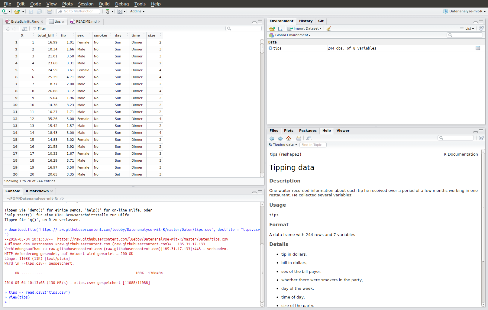

```{r setup, include=FALSE}
knitr::opts_chunk$set(echo = TRUE)

```


## Hinweise
[R](https://cran.r-project.org) ist der Name eines Programms für Statistik und Datenanalyse, [RStudio](https://www.rstudio.com) ist eine komfortable Entwicklungsumgebung für R.

Nach dem Start von R Studio erscheint folgender Bildschirm:


```{r echo=FALSE}
knitr::include_graphics("../../Installation/RStudio-Screenshot.png",
dpi = 300)
```

Links, in der *Console* werden die Befehle eingegeben. Rechts oben können Sie z. B. die Daten, aber auch andere Objekte, mit denen Sie arbeiten, betrachten, auch die Historie der Befehle wird dort angezeigt. Rechts unten können Sie u. a. Dateien und Abbildungen auswählen, aber auch Hilfeseiten und Tipps betrachten.

Wir werden zunächst in der Konsole arbeiten.

Ein paar Anmerkungen vorweg:

* R unterscheidet zwischen Groß- und Kleinbuchstaben, d.h. `Oma` und `oma` sind zwei verschiedene Dinge für R!
* R verwendet den Punkt `.` als Dezimaltrennzeichen
* Fehlende Werte werden in R durch `NA` kodiert
* Kommentare werden mit dem Rautezeichen `#` eingeleitet; der Rest der Zeile von von R dann ignoriert.
* R wendet Befehle direkt an
* R ist objektorientiert, d. h. dieselbe Funktion hat evtl. je nach Funktionsargument unterschiedliche Rückgabewerte
* Hilfe zu einem Befehl erhält man über ein vorgestelltes Fragezeichen `?`
* Zusätzliche Funktionalität kann über Zusatzpakete hinzugeladen werden. Diese müssen ggf. zunächst  installiert werden
* Mit der Pfeiltaste nach oben können Sie einen vorherigen Befehl wieder aufrufen


## R als Taschenrechner
Auch wenn Statistik nicht Mathe ist, so kann man mit R auch rechnen. Geben Sie zum Üben die Befehle in der R Konsole hinter der Eingabeaufforderung `>` ein und beenden Sie die Eingabe mit `Return` bzw. `Enter`.
```{r}
4+2
```
Das Ergebnis wird direkt angezeigt.
Bei 
```{r}
x <- 4+2
```
erscheint zunächst kein Ergebnis. Über `<-` wird der Variable `x` der Wert `4+2` zugewiesen. Wenn Sie jetzt
```{r eval=FALSE}
x
```
eingeben, wird das Ergebnis
```{r echo=FALSE}
x
```
angezeigt. Sie können jetzt auch mit `x` weiterrechnen.
```{r}
x/4
```
Vielleicht fragen Sie sich was die `[1]` vor dem Ergebnis bedeutet. R arbeitet vektororientiert, und die `[1]` zeigt an, dass es sich um das erste (und hier auch letzte) Element des Vektors handelt. 

## R zur Datenanalyse
Wir wollen R aber als Tool zur Datenanalyse verwenden. Daher müssen wir zunächst Daten einlesen.
Zunächst laden wir die Daten als `csv` Datei von der richtigen Adresse (`URL`) herunter:
```{r eval=FALSE}
download.file("https://goo.gl/whKjnl", destfile = "tips.csv")
```
R hat die Datei jetzt im aktuellen Verzeichnis unter den Namen `tips.csv` gespeichert. 

[Hier](https://github.com/luebby/Datenanalyse-mit-R/blob/master/Daten/tips-help.pdf) können Sie mehr über die Daten erfahren. 

Wo das lokale Verzeichnis ("working directory") ist, können Sie über
```{r eval=FALSE}
getwd()
```
erfahren.

```{r, echo = FALSE}
tips <- read.csv2("../../Daten/tips.csv")
```


Das Einlesen von `csv` Dateien aus dem Arbeitsverzeichnis in R kann erfolgen über
```{r, eval = FALSE}
tips <- read.csv2("tips.csv")
```
Der Datensatz `tips` taucht jetzt im `Enviroment` Fenster rechts oben in RStudio auf. Durch Klicken auf den Namen können Sie diese betrachten.

```{r echo=FALSE, eval=FALSE}

```


Alternativ können Sie Daten in RStudio komfortabel mit dem Button `Import Dataset` (im Fenster `Environment` oder über das Menü `File` und `Open File...`) öffnen.


## Erste Analyse des tips Datensatzes
Dieser Datensatz aus 

*Bryant, P. G. and Smith, M (1995) Practical Data Analysis: Case Studies in Business Statistics. Homewood, IL: Richard D. Irwin Publishing*

enthält Trinkgelddaten. Diese sind in tabellarischer Form dargestellt, d. h. üblicherweise, dass die Beobachtungen zeilenweise untereinander stehen, die einzelnen Variablen spaltenweise nebeneinander. In R heißen solche Daten *data frame*. Um einen ersten Überblick über die verschiedenen Variablen zu erhalten geben wir den Befehl 
`str()` ein:
```{r}
str(tips)
```
Dieser enthält also `r dim(tips)[1]` Zeilen (Beobachtungen) und `r dim(tips)[2]` Spalten (Variablen). Alternativ kann man diese Information auch über 

```{r}
dim(tips)
```
erhalten.

Metrische Variablen sind in R in der Regel vom Typ `numeric`, kategorielle Variablen vom Typ `factor`. `str` und `dim` sind erste Befehle, d. h. Funktionen in R, denen in der Klammer das jeweilige Funktionsargument übergeben wird.
```{r eval=FALSE}
head(tips) # Obere Zeilen
tail(tips) # Untere Zeilen 
```
Ermöglichen ebenfalls einen Einblick über die Daten. Der Befehl
```{r eval=FALSE}
names(tips)
```
gibt die Variablennamen zurück.
Mit Hilfe des `$` Operators kann auf einzelne Variablen eines Dataframes zugegriffen werden:
```{r eval=FALSE}
tips$sex
```
erhalten Sie bspw. das Geschlecht des Rechnungszahlers.

***
**Übung:** Lassen Sie sich die Variable Rechnungshöhe (`total_bill`) anzeigen.

***
### mosaic
`mosaic` ist ein Zusatzpaket, welches die Analyse mit R erleichtert. Sofern noch nicht geschehen, muss es *einmalig* über
```{r eval=FALSE}
install.packages("mosaic")
```
installiert werden.

Um es verwenden zu können, muss es - wie jedes Paket - für *jede* neue R-Sitzung über
```{r message=FALSE}
require(mosaic)
```
geladen werden.

Der Grundgedanke von `mosaic` ist *Modellierung*. In R und insbesondere in mosaic wir dafür die Tilde `~` verwendet. `y~x` kann dabei gelesen werden wie "y ist eine Funktion von x". Beispielsweise um eine Abbildung (Scatterplot) des Trinkgeldes `tip` (auf der Y-Achse) und Rechnungshöhe `total_bill` (auf der X-Achse) zu erhalten, kann man in R folgenden Befehl eingeben:

```{r eval=FALSE}
xyplot(tip ~ total_bill, data=tips)
```
Das Argument `data=tips` stellt klar, aus welchen Datensatz die Variablen kommen. Die Abbildung ist im RStudio jetzt rechts unten im Reiter *Plots*  zu sehen.

***
**Übung:** Wie würden Sie den Trend beschreiben?
***
Wie oben erwähnt können wir R auch gut als Taschenrechner benutzen, sollten aber bedenken, dass R vektorweise arbeitet. D. h. 
```{r eval=FALSE}
tips$tip/tips$total_bill
```
gibt für *jede Beobachtung* die relative Trinkgeldhöhe bezogen auf die Rechnungshöhe an. Über 
```{r eval=FALSE}
(tips$tip/tips$total_bill)<0.10
```
erhalten wir einen Vektor vom Typ `logical`. Dieser nimmt nur zwei Werte an, nämlich `TRUE` und `FALSE`, je nach dem ob der jeweilige Wert kleiner als 0.10 ist oder nicht. Neben `<` und `>` bzw. `<=` und `>=` gibt es ja auch noch die Prüfung auf Gleichheit. Hierfür werden in R gleich *zwei* Gleichheitszeichen verwendet, also `==`.


***
**Übung:** Was gibt folgender der Befehl zurück?
```{r eval=FALSE}
tips$sex=="Female" 
```
***

Logische Vektoren können z.B. mit "und" `&` oder "oder" `|` verknüpft werden:
```{r eval=FALSE}
tips$sex=="Female" & tips$smoker=="Yes"
```
gibt die Tischgesellschaften wieder, in denen die Rechnung von von Frauen beglichen wurde *und* geraucht wurde,
```{r eval=FALSE}
tips$sex=="Female" | tips$smoker=="Yes"
```
gibt die Tischgesellschaften wieder, in denen die Rechnung von von Frauen beglichen wurde *oder* geraucht wurde.

Intern wird `TRUE` in R mit der Zahl 1 hinterlegt, `FALSE` mit 0. Mit dem Befehl `sum()` kann man daher die Elemente eines Vektor aufsummieren, also erfahren wir über 
```{r eval=FALSE}
sum(tips$sex=="Female" & tips$smoker=="Yes")
```
dass bei `r sum(tips$sex=="Female" & tips$smoker=="Yes")` Tischgesellschaften bei denen geraucht wurde, eine Frau die Rechnung bezahlte. Im Verhältnis zu allen Tischgesellschaften, bei denen eine Frau zahlte, liegt der Raucheranteil also bei `r round(sum(tips$sex=="Female" & tips$smoker=="Yes"), 2) /sum(tips$sex=="Female")`:
```{r eval=FALSE}
sum(tips$sex=="Female" & tips$smoker=="Yes") / sum(tips$sex=="Female")
```

***
**Übung:** Wurde bei den Tischgesellschaften, bei denen ein Mann zahlte relativ häufiger geraucht als bei den Frauen?
***

## Übung: Teaching Rating
Dieser Datensatz analysiert u. a. den Zusammenhang zwischen Schönheit und Evaluierungsergebnis:

*Hamermesh, D.S., and Parker, A. (2005). Beauty in the Classroom: Instructors' Pulchritude and Putative Pedagogical Productivity. Economics of Education Review, 24, 369–376.*

Sie können ihn von  [https://goo.gl/6Y3KoK](https://goo.gl/6Y3KoK)  herunterladen. [Hier](https://github.com/luebby/Datenanalyse-mit-R/blob/master/Daten/TeachingRatings-help.pdf) gibt es eine Beschreibung.

1.  Lesen Sie den Datensatz in R ein.
2.  Wie viele Zeilen, wie viele Spalten liegen vor?
3.  Wie heißen die Variablen?
4.  Betrachten Sie visuell den Zusammenhang von dem Evaluierungsergebnis `eval` und Schönheit `beauty`. Was können Sie erkennen?
5.  Sind relativ mehr Frauen oder mehr Männer (`gender`) auf einen Tenure Track (`tenure`)?

## Daten importieren

Der Datenimport in R ist in vielen unterschiedlichen Dateiformaten möglich. Das `csv` Format eignet sich besonders zum Übertragen von Datendateien. Im deutschsprachigen Raum wird dabei als *Dezimaltrennzeichen* das Komma `,` und als *Datentrennzeichen* das Semikolon `;` verwendet. In der ersten Zeile sollten die Variablennamen stehen. Das Einlesen in einen R Data-Frame (hier `meineDaten`) kann dann über
```{r eval=FALSE}
meineDaten <- read.csv2(file.choose()) # Datei auswählen
```
erfolgen.

Der Befehl `file.choose()` öffnet dabei den Dateiordner. Bei "internationalen" `csv` Dateien ist das Datentrennzeichen i. d. R. ein Komma `,`, das Dezimaltrennzeichen ein Punkt `.`. Hier funktioniert der Import in R dann über den Befehl `read.csv`.

In R Studio gibt es im Reiter `Environment` im Fenster Rechts oben einen Menüpunkt `Import Dataset` der mehr Einstellmöglichkeiten bietet.

[Hier](https://www.fom.de/forschung/institute/ifes/studium-und-lehre.html#!acc=datenquellen) finden Sie eine Linksammlung zu verschiedenen Datenquellen. 

***
Diese Übung basiert teilweise auf Übungen zum Buch [OpenIntro](https://www.openintro.org/stat/index.php?stat_book=isrs) von Andrew Bray und Mine &Ccedil;etinkaya-Rundel unter der Lizenz [Creative Commons Attribution-ShareAlike 3.0 Unported](http://creativecommons.org/licenses/by-sa/3.0). 

### Versionshinweise:
* Datum erstellt: `r Sys.Date()`
* R Version: `r getRversion()`
* `mosaic` Version: `r packageVersion("mosaic")`
