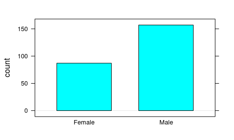
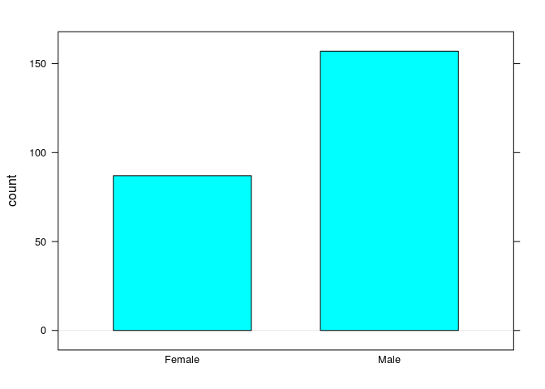
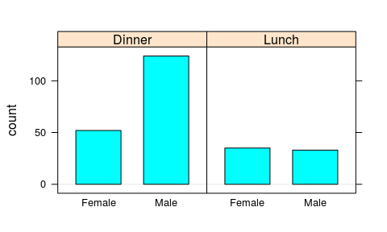
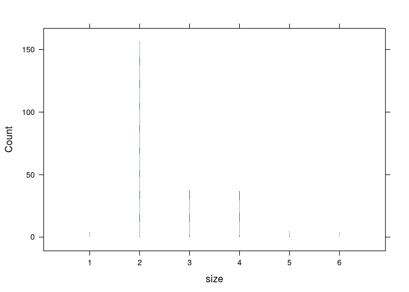
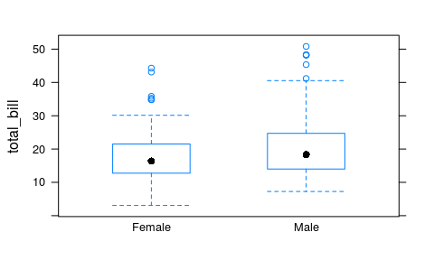
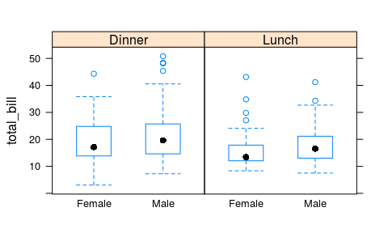
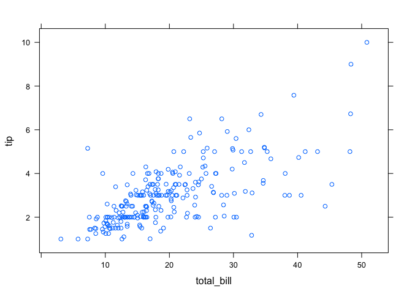
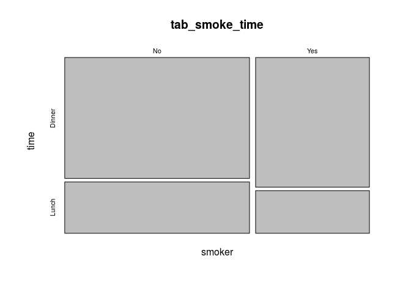
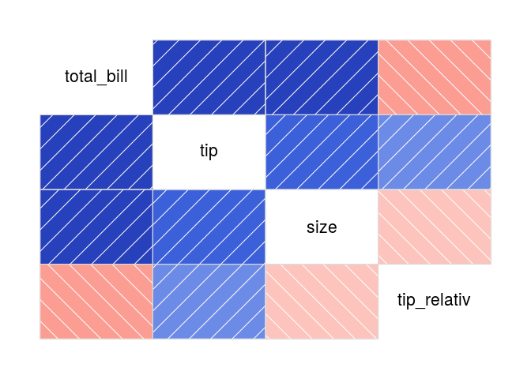
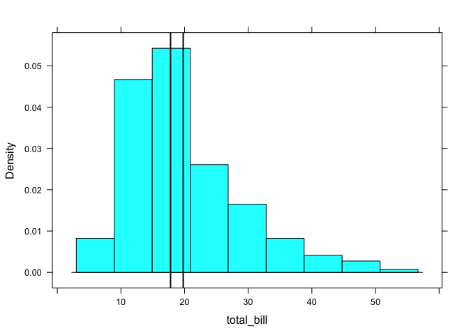

Einführung in Daten
================
Karsten Lübke

Datensatz
---------

Wir werden jetzt den *tips* Datensatz aus *Bryant, P. G. and Smith, M (1995) Practical Data Analysis: Case Studies in Business Statistics. Homewood, IL: Richard D. Irwin Publishing* näher analysieren.

<<<<<<< HEAD
Sofern noch nicht geschehen, können Sie in [hier](https://goo.gl/whKjnl) als `csv`-Datei herunterladen:
=======
Sofern noch nicht geschehen, können Sie in als `csv` Datei herunterladen:
>>>>>>> master

``` r
download.file("https://goo.gl/whKjnl", destfile = "tips.csv")
```

<<<<<<< HEAD
Das Einlesen erfolgt, sofern die Daten im Arbeitsverzeichnis liegen, über:
=======
Das Einlesen erfolgt, sofern die Daten im aktuellen Verzeichnis liegen, über:
>>>>>>> master

``` r
tips <- read.csv2("tips.csv")
```

<<<<<<< HEAD
*Tipp:* Wenn Sie nicht mehr wissen, wo die Daten liegen: statt `"tips.csv"` den Befehl `file.choose()` als Argument für die Funktion `read.csv2` verwenden.
=======
*Tipp:* Wenn Sie nicht mehr wissen wo die Daten liegen: statt `tips.csv` den Befehl `file.choose()` als Argument für die Funktion `read.csv2` verwenden.
>>>>>>> master

Inwieweit das Einlesen wie gewünscht geklappt hat, kann über

``` r
str(tips)
```

<<<<<<< HEAD
überprüft werden: Der Datensatz hat also 244 Zeilen (=Beobachtungen) und 7 Spalten (=Merkmale/ Variablen).
=======
überprüft werden. Der Datensatz hat also 244 Zeilen (=Beobachtungen) und 7 Spalten (=Merkmale/ Variablen).
>>>>>>> master

Zur folgenden Analyse muss zunächst das Paket `mosaic` geladen werden:

``` r
require(mosaic)
```

Grafische Verfahren der Datenanalyse
------------------------------------

Bevor evtl. wichtige Information in zusammenfassenden Kennzahlen verloren geht, versuchen wir einen Gesamtüberblick zu erhalten.

### Balkendiagramm

<<<<<<< HEAD
Balkendiagramme eignen sich am besten um Häufigkeiten darzustellen, also für kategorielle Variablen (`factor`) oder für metrische Variablen (`numeric`) mit wenigen Merkmalsausprägungen. Um einen Überblick über die Geschlechterverteilung `sex` zu bekommen kann die Funktion `bargraph` aus dem Paket `mosaic` verwendet werden:
=======
Balkendiagramme eignen sich für kategorielle Variablen (`factor`) oder für metrische Variablen (`numeric`) mit wenigen Merkmalsausprägungen. Um einen Überblick über die Geschlechterverteilung `sex` zu bekommen kann die Funktion `bargraph` aus dem Paket `mosaic` verwendet werden:
>>>>>>> master

``` r
bargraph(~ sex, data=tips)
```

<<<<<<< HEAD

=======

>>>>>>> master

In mosaic wird (fast) immer die Formeldarstellung `y ~ x | z` verwendet: `y` wird modelliert durch `x` in Abhängigkeit der Werte von `z`, wobei einzelne Teile fehlen können, so wie im Beispiel `y` und `z`. Aber um z. B. die Verteilung des Geschlechts des Zahlenden je Tageszeit `time` darzustellen muss hier eingegeben werden:

``` r
bargraph(~ sex | time, data=tips)
```

<<<<<<< HEAD

=======

>>>>>>> master

------------------------------------------------------------------------

**Übung:** Zeichnen Sie ein Balkendiagramm des Rauchverhaltens `smoker` je Wochentag `day` und interpretieren Sie das Ergebnis.

------------------------------------------------------------------------

### Histogramm

Histogramme werden für metrische Daten verwendet, der Befehl lautet `histogram`.

------------------------------------------------------------------------

**Übung:** Welche Abbildung wird über

``` r
histogram(~ total_bill | sex, data=tips)
```

erzeugt?

------------------------------------------------------------------------

<<<<<<< HEAD
**Punktdiagramme** sind eine Variante von Histogrammen, die besonders für metrische Variablen mit wenigen Merkmalsausprägungen geeignet sind.
=======
**Punkdiagramme** sind eine Variante von Histogrammen, die besonders für metrische Variablen mit wenigen Merkmalsausprägungen geeignet sind.
>>>>>>> master

``` r
dotPlot(~ size, nint=6, data=tips)
```

<<<<<<< HEAD


Hier wurde ein zusätzliche Parameter der Funktion `dotPlot` übergeben: `nint=6`. Dieser Parameter wurde wurde verwendet, um die Abbildung schöner zu machen. Welche Optionen es gibt und was diese bedeuten, kann man in R häufig einfach über die Hilfe, hier also `?dotPlot`, erfahren.

### Boxplots

Boxplots zeigen nicht nur den Median (50%-Quantil) sowie das obere (75%) und untere (25%) Quartil - und damit den Interquartilsabstand -, sondern geben auch Hinweise auf potentielle Ausreißer:
=======


Hier wurden zusätzliche Parameter der Funktion `dotPlot` übergeben, `nint=6` u. Diese wurden verwendet um die Abbildung schöner zu machen. Welche Optionen es gibt und was diese bedeuten kann man in R häufig einfach über die Hilfe, hier also `?dotPlot` erfahren.

### Boxplots

Boxplots zeigen nicht nur den Median (50%-Quantil), sondern auch das obere (75%) und untere (25%) Quartil - und damit den Interquartilsabstand - sondern geben auch Hinweise auf potentielle Ausreißer:
>>>>>>> master

``` r
bwplot(total_bill ~ sex, data=tips)
```

<<<<<<< HEAD

=======

>>>>>>> master

und gruppiert nach Tageszeit:

``` r
bwplot(total_bill ~ sex | time, data=tips)
```

<<<<<<< HEAD

=======

>>>>>>> master

------------------------------------------------------------------------

**Übung:** Zeichen Sie einen Boxplot für die Trinkgeldhöhe `tip` in Abhängigkeit davon, ob geraucht wurde `smoker`. Gibt es Unterschiede in der Trinkgeldhöhe, und wenn ja in welchem Bereich?

------------------------------------------------------------------------

<<<<<<< HEAD
### Scatterplot (Streudiagramme)

Streudiagramme sind besonders gut geeignet, um einen Überblick auf den Zusammenhang zweier metrischer Merkmale zu erhalten; beispielsweise um den Zusammenhang von `tip` und `total_bill` zu analysieren.
=======
### Scatterplot

Streudiagramme sind besonders gut geeignet um einen ersten Blick auf den Zusammenhang zweier metrischer Merkmale zu erhalten. Beispielsweise um den Zusammenhang von `tip` und `total_bill` zu analysieren.
>>>>>>> master

``` r
xyplot(tip ~ total_bill, data=tips)
```

<<<<<<< HEAD

=======

>>>>>>> master

Wenig überraschend steigt die Trinkgeldhöhe mit der Rechnung. Wie sieht es relativ aus? Dazu müssen wir zunächst ein neues Merkmal im Datensatz erzeugen, z. B.:

``` r
tips$tip_relativ <- tips$tip / tips$total_bill
```

Im Datensatz `tips` wird der (neuen) Variable `tip_relativ` der Quotient aus Trinkgeld und Rechnungshöhe zugewiesen.

------------------------------------------------------------------------

**Übung:** Erstellen Sie eine Abbildung, mit der Sie visuell gucken können, wie der Zusammenhang zwischen der relativen Trinkgeldhöhe (abhängige Variable) und der Rechnungshöhe (uanbhängige Variable) aussieht, und ob sich dieser je nach Geschlecht des Rechnungszahlers unterscheidet.

------------------------------------------------------------------------

### Mosaicplot

<<<<<<< HEAD
Mosaicplots eignen sich, um den Zusammenhang zwischen kategoriellen Variablen darzustellen. Zunächst müssen wir dazu eine Kreuztabelle erstellen. Das geht in `mosaic` über den Befehl `tally`. Dieser Befehl ist recht mächtig -- dazu später mehr. Wir erzeugen eine solche Kreuztabelle zwischen Tageszeit und Rauchen über
=======
Mosaicplots eignen sich, um den Zusammenhang zwischen kategoriellen Variablen darzustellen. Zunächst müssen wir dazu eine Kreuztabelle erstellen. Die geht in `mosaic` über den Befehl `tally`. Dieser ist recht mächtig -- dazu später mehr. Wir erzeugen eine solche Kreuztabelle zwischen Tageszeit und Rauchen über
>>>>>>> master

``` r
tab_smoke_time <- tally(smoker ~ time, data=tips)
```

Dem (neuen) R Objekt `tab_smoke_time` wird also das Ergebnis des `tally` Befehls zugewiesen. Wie das Ergebnis aussieht, und welchen Typ es hat erfahren wir über

``` r
print(tab_smoke_time)
```

    ##       time
    ## smoker Dinner Lunch
    ##    No     106    45
    ##    Yes     70    23

``` r
str(tab_smoke_time)
```

    ##  'table' int [1:2, 1:2] 106 70 45 23
    ##  - attr(*, "dimnames")=List of 2
    ##   ..$ smoker: chr [1:2] "No" "Yes"
    ##   ..$ time  : chr [1:2] "Dinner" "Lunch"

Es handelt sich also um eine Tabelle (`table`) der Dimension 2, 2, also 2 Zeilen, 2 Spalten.

Der Befehl für einen Mosaicplot lautet `mosaicplot`:

``` r
mosaicplot(tab_smoke_time)
```

<<<<<<< HEAD


### Korrelationsplot

Mit Hilfe des Zusatzpakets `corrgram` lassen sich Korrelationen besonders einfach visualisieren. Das Paket muss wie jedes Paket *einmalig* über
=======


### Korrelationsplot

Mit Hilfe des Zusatzpakets `corrgram` lassen sich Korrelationen besonders einfach visualisieren. Die muss *einmalig* über
>>>>>>> master

``` r
install.packages("corrgram")
```

<<<<<<< HEAD
installiert werden -- wiederum werden weitere benötigte Pakete mit-installiert. Nach dem Laden des Pakets über
=======
installiert werden -- wiederum werden weitere Pakete mit-installiert. Nach dem Laden des Pakets über
>>>>>>> master

``` r
require(corrgram)
```

kann dies über

``` r
corrgram(tips)
```

<<<<<<< HEAD


gezeichnet werden. Je intensiver die Farbe, desto höher die Korrelation. Hier gibt es unzählige Einstellmöglichkeiten, siehe `?corrgram` bzw. für Beispiele:
=======


gezeichnet werden. Je intensiver die Farbe, desto höher die Korrelation. Hier gibt es unzählige Einstellmöglichkeiten: `?corrgram`, bzw. für Beispiele:
>>>>>>> master

``` r
vignette("corrgram_examples")
```

Kennzahlen der Datenanalyse
---------------------------

<<<<<<< HEAD
Nachdem wir einen ersten visuellen Eindruck gewonnen haben wollen, wir uns jetzt Kennzahlen widmen.
=======
Nachdem wir einen ersten visuellen Eindruck gewonnen haben wollen wir uns jetzt Kennzahlen widmen.
>>>>>>> master

### Lagemaße

Das Minimum und Maximum von metrischen Daten kann einfach durch `min` bzw. `max` bestimmt werden, in `mosaic` auch "modelliert":

``` r
min(~ total_bill | smoker, data=tips)
```

    ##   No  Yes 
    ## 7.25 3.07

gibt also das Minimum der Rechnungshöhe, getrennt nach Raucher und Nichtrauchern an, d. h. das Minimum bei den Rauchern lag bei 3.07$.

------------------------------------------------------------------------

<<<<<<< HEAD
**Übung:** Bestimmen Sie das Maximum der Trinkgeldhöhe je

------------------------------------------------------------------------

Lagemaße sollen die zentrale Tendenz der Daten beschreiben. Gebräuchlich sind in der Regel der arithmetische Mittelwert `mean`
=======
**Übung:** Bestimmen Sie das Maximum der Trinkgeldhöhe je Geschlecht.

------------------------------------------------------------------------

Die Meisten Lagemaße sollen die zentrale Tendenz der Daten beschreiben. Gebräuchlich sind in der Regel der arithmetische Mittelwert `mean`
>>>>>>> master

``` r
mean(~ total_bill, data=tips)
```

    ## [1] 19.78594

sowie der Median `median`:

``` r
median(~ total_bill, data=tips)
```

    ## [1] 17.795

Diese unterscheiden sich:

``` r
meantb <- mean(~ total_bill, data=tips) # Mittelwert
mediantb <- median(~ total_bill, data=tips) # Median
histogram(~ total_bill, v=c(meantb, mediantb), data=tips)
```

<<<<<<< HEAD

=======

>>>>>>> master

------------------------------------------------------------------------

**Übung:** Begründen Sie anhand des Histogramms, warum hier der Median kleiner als der arithmetische Mittelwert ist.

------------------------------------------------------------------------

<<<<<<< HEAD
Auch Lagemaße zu berechnen in Abhängigkeit der Gruppenzugehörigkeit ist einfach. So berechnet man den arithmetischen Mittelwert in Abhängigkeit von Geschlecht und Tageszeit:
=======
Auch Lagemaße in Abhängigkeit von Gruppen ist einfach. Bestimme den arithmetischen Mittelwert in Abhängigkeit von Geschlecht und Tageszeit:
>>>>>>> master

``` r
mean(total_bill ~ sex + time, data=tips)
```

    ## Female.Dinner   Male.Dinner  Female.Lunch    Male.Lunch 
    ##      19.21308      21.46145      16.33914      18.04848

------------------------------------------------------------------------

**Übung:** Bestimmen Sie den Median der Trinkgeldhöhe anhand der Anzahl Personen in der Tischgesellschaft.

------------------------------------------------------------------------

Für kategorielle Variablen können eigentlich zunächst nur die Häufigkeiten bestimmt werden:

``` r
tally(~day, data=tips)
```

    ## 
    ##  Fri  Sat  Sun Thur 
    ##   19   87   76   62

<<<<<<< HEAD
Relative Häufigkeiten werden bei `mosaic` mit der zusätzlichen Option `format="proportion"` angefordert:
=======
Reaktive Häufigkeiten mit der zusätzlichen Option `format="proportion"`, de. H.:
>>>>>>> master

``` r
tally(~day, format="proportion", data=tips)
```

    ## 
    ##        Fri        Sat        Sun       Thur 
    ## 0.07786885 0.35655738 0.31147541 0.25409836

### Streuungsmaße

Die Variation der Daten, die wir grafisch und auch in den (bedingten) Lagemaßen gesehen haben ist eines der zentralen Themen der Statistik: Können wir die Variation vielleicht erklären? Variiert die Rechnungshöhe vielleicht mit der Anzahl Personen?

<<<<<<< HEAD
Zur Bestimmung der Streuung werden in der Regel der Interquartilsabstand `IQR` sowie Varianz `var` bzw. Standardabweichung `sd` herangezogen:
=======
Zur Bestimmung der Streuung werden in der Regel der Interquartilsabstand `IQsR` sowie Varianz `var` bzw. Standardabweichung `sd` herangezogen:
>>>>>>> master

``` r
IQR(~total_bill, data=tips)
```

    ## [1] 10.78

``` r
var(~total_bill, data=tips)
```

    ## [1] 79.25294

``` r
sd(~total_bill, data=tips)
```

    ## [1] 8.902412

Um die Standardabweichung in Abhängigkeit der Gruppengröße zu berechnen genügt der Befehl:

``` r
sd(~total_bill | size, data=tips)
```

    ##        1        2        3        4        5        6 
    ## 3.010729 6.043729 9.407065 8.608603 7.340396 9.382000

<<<<<<< HEAD
Bei 4 Personen lag die Standardabweichung als bei 8.61$.
=======
Bei 4 Personen lag die Standardabweichung als bei 8.6086027$.
>>>>>>> master

Um jetzt z. B. den Variationskoeffizienten zu berechnen wird

``` r
sd(~total_bill | size, data=tips) / mean(~total_bill | size, data=tips)
```

    ##         1         2         3         4         5         6 
    ## 0.4157031 0.3674443 0.4041247 0.3008579 0.2441265 0.2693655

gebildet.

------------------------------------------------------------------------

**Übung:** Zu welcher Tageszeit ist die Standardabweichung des Trinkgelds geringer? Zum Lunch oder zum Dinner?

------------------------------------------------------------------------

Die *üblichen* deskriptiven Kennzahlen sind in `mosaic` übrigens in einer Funktion zusammengefasst: `favstats`:

``` r
favstats(tip~day, data=tips)
```

    ##    day  min     Q1 median     Q3   max     mean       sd  n missing
    ## 1  Fri 1.00 1.9600  3.000 3.3650  4.73 2.734737 1.019577 19       0
    ## 2  Sat 1.00 2.0000  2.750 3.3700 10.00 2.993103 1.631014 87       0
    ## 3  Sun 1.01 2.0375  3.150 4.0000  6.50 3.255132 1.234880 76       0
    ## 4 Thur 1.25 2.0000  2.305 3.3625  6.70 2.771452 1.240223 62       0

### Zusammenhangsmaße

Kennzahlen für den linearen Zusammenhang von metrischen Variablen sind Kovarianz `cov` und der Korrelationskoeffizient `cor`:

``` r
cov(tip, total_bill, data=tips)
```

    ## [1] 8.323502

``` r
cor(tip, total_bill, data=tips)
```

    ## [1] 0.6757341

Für kategorielle Variablen wird in diesen Abschnitt zunächst nur die Kreuztabelle verwendet:

``` r
tally(smoker~sex, format="proportion", data=tips)
```

    ##       sex
    ## smoker    Female      Male
    ##    No  0.6206897 0.6178344
    ##    Yes 0.3793103 0.3821656

------------------------------------------------------------------------

**Übung:** Zu welcher Tageszeit wurde relativ häufiger von einer Frau die Rechnung bezahlt?

------------------------------------------------------------------------

Übung: Teaching Rating
----------------------

<<<<<<< HEAD
Dieser Datensatz analysiert u. a. den Zusammenhang zwischen Schönheit und Evaluierungsergebnis von Dozenten:

*Hamermesh, D.S., and Parker, A. (2005). Beauty in the Classroom: Instructors' Pulchritude and Putative Pedagogical Productivity. Economics of Education Review, 24, 369–376.*

Sie können ihn von <https://goo.gl/6Y3KoK> herunterladen.
=======
Dieser Datensatz analysiert u. a. den Zusammenhang zwischen Schönheit und Evaluierungsergebnis:

*Hamermesh, D.S., and Parker, A. (2005). Beauty in the Classroom: Instructors' Pulchritude and Putative Pedagogical Productivity. Economics of Education Review, 24, 369–376.*

Sie können ihn von `https://goo.gl/6Y3KoK` herunterladen.
>>>>>>> master

1.  Erstellen Sie ein Balkendiagramm der Variable `native` gruppiert nach der Variable `minority`.
2.  Erstellen Sie ein Histogramm der Variable `beauty` gruppiert nach der Variable `gender`.
3.  Vergleichen Sie das Evaluationsergebnis `eval` in Abhängigkeit ob es sich um einen Single-Credit Kurs `credits` handelt mit Hilfe eines Boxplots.
4.  Zeichnen Sie ein Scatterplot der Variable `eval` in Abhängigkeit der zu definierenden Variable "Evaluierungsquote": `students/allstudents`.
5.  Berechnen Sie deskriptive Kennzahlen der Variable `eval` in Abhängigkeit ob es sich um einen Single-Credit Kurs `credits` handelt.

------------------------------------------------------------------------

Diese Übung basiert teilweise auf Übungen zum Buch [OpenIntro](https://www.openintro.org/stat/index.php?stat_book=isrs) von Andrew Bray und Mine Çetinkaya-Rundel unter der Lizenz [Creative Commons Attribution-ShareAlike 3.0 Unported](http://creativecommons.org/licenses/by-sa/3.0).

### Versionshinweise:

<<<<<<< HEAD
-   Datum erstellt: 2016-06-02
=======
-   Datum erstellt: 2016-05-20
>>>>>>> master
-   R Version: 3.3.0
-   `mosaic` Version: 0.13.0
