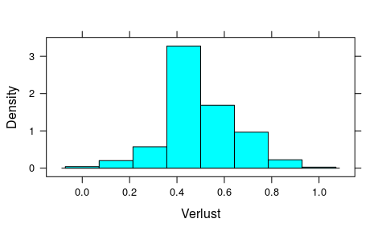
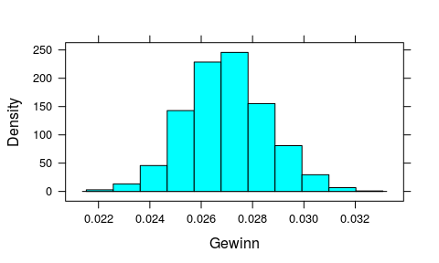
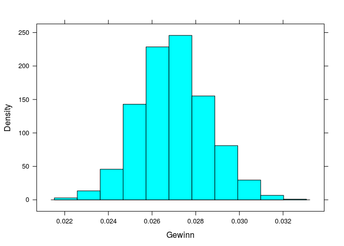
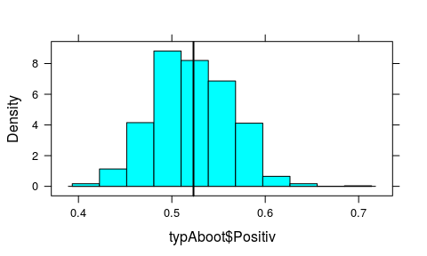
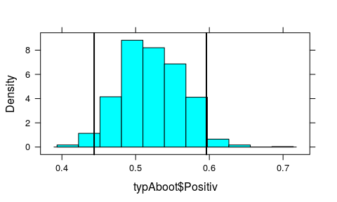
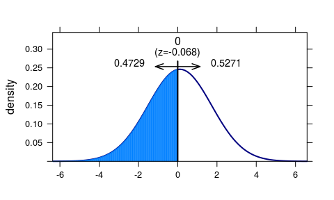
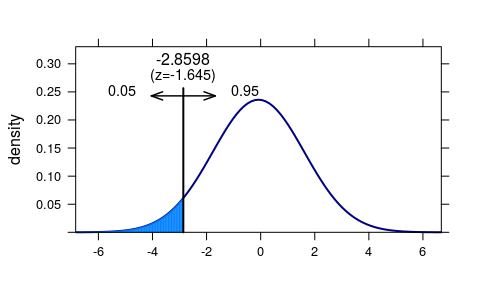

Einführung Wahrscheinlichkeit und Inferenz
================
Karsten Lübke

Zufall und Wahrscheinlichkeit
-----------------------------

In dieser Übung werden wir ein wenig programmieren, daher bietet es sich an die Befehle in einem Skript zu speichern. Gehen Sie dazu in R Studio in das Menü `File` und dort auf `New File` und wählen `R Script` aus. Dies können Sie dann am Ende über `File` und `Save` bzw. `Safe as` speichern -- und über `Open File` später auch wieder öffnen. Um die Befehle an die Konsole zu übergeben klicken Sie entweder auf `Run` (nur ausgewählte Zeile) oder `Source` (ganze Programm).

Zunächst laden wir wieder das Zusatzpaket mosaic:

``` r
require(mosaic)
```

Um den Zufall zu bändigen setzen wir den Zufallszahlengenerator, z. B. auf `1896`

``` r
set.seed(1896)
```

Dieser Befehl sorgt dafür, dass wir immer denselben "Zufall" haben.

Beim Roulette gibt es 37 Zahlen und 3 Farben: 0-37, wobei 18 Zahlen Schwarz, 18 Zahlen Rot und die 0 Grün ist -- auf diese können Sie auch nicht setzen.

Angenommen Sie setzen auf Farbe. Dann beträgt Ihre Gewinnwahrscheinlichkeit 18/37, da 18 von 37 Fächern "ihre" Farbe hat, die Wahrscheinlichkeit eines Verlustes liegt bei 19/37=1-18/37.

Definieren wir in R einen `factor`-Vektor für Gewinn und Verlust

``` r
roulette <- factor(c("Gewinn", "Verlust"))
```

Mit diesem können wir jetzt virtuell und ganz ohne Risiko über den Befehl `resample` Roulette spielen

``` r
resample(roulette, size=1, prob=c(18/37, 19/37))
```

    ## [1] Gewinn
    ## Levels: Gewinn Verlust

``` r
resample(roulette, size=10, prob=c(18/37, 19/37))
```

    ##  [1] Gewinn  Gewinn  Gewinn  Gewinn  Gewinn  Gewinn  Verlust Gewinn 
    ##  [9] Verlust Gewinn 
    ## Levels: Gewinn Verlust

Mit dem Argument `size` wird also eingestellt, wie oft Roulette gespielt wird, `prob` ist der Vektor der Wahrscheinlichkeiten für die einzelnen Elemente im Ereignisvektor, hier `roulette`.

Über

``` r
spiele <- resample(roulette, size=100, prob=c(18/37, 19/37))
```

wird dem Vektor `spiele` das Ergebnis von `100` Roulettespielen zugewiesen. Die Häufigkeitsverteilung erhalten wir wie gewohnt über den Befehl `tally`:

``` r
tally(~spiele, format="proportion")
```

    ## 
    ##  Gewinn Verlust 
    ##    0.51    0.49

Das **Gesetz der großen Zahl** sagt aus, dass sich auf *lange* Sicht die beobachtete relative Häufigkeit der theoretischen Wahrscheinlichkeit annähert:

``` r
tally(~resample(roulette, size=10, prob=c(18/37, 19/37)), format="proportion")
```

    ## 
    ##  Gewinn Verlust 
    ##     0.7     0.3

``` r
tally(~resample(roulette, size=100, prob=c(18/37, 19/37)), format="proportion")
```

    ## 
    ##  Gewinn Verlust 
    ##    0.44    0.56

``` r
tally(~resample(roulette, size=1000, prob=c(18/37, 19/37)), format="proportion")
```

    ## 
    ##  Gewinn Verlust 
    ##   0.488   0.512

``` r
tally(~resample(roulette, size=1000000, prob=c(18/37, 19/37)), format="proportion")
```

    ## 
    ##   Gewinn  Verlust 
    ## 0.486433 0.513567

Die theoretische Wahrscheinlichkeit eines Gewinns liegt bei 18/37=0.4864865: Achtung, dass Gesetz der großen Zahl gilt für den Durchschnitt und auf lange Sicht, evtl. Ungleichgewichte, z. B. 5 Gewinne in Folge werden im Laufe der Zeit abgeschwächt, und nicht durch anschließende 5 Verluste ausgeglichen.

Bei bestimmten Spielstrategien, z. B. bei der sogenannten Martingale oder Verdoppelungsstrategie, ist man interessiert daran wie wahrscheinlich es ist, z. B. 8-mal in Folge zu verlieren. Natürlich kann man das mit Hilfe der *Binomialverteilung* ausrechnen, wir können es aber auch simulieren: `do()` ist eine einfache Schleifenfunktion in mosaic. Um z. B. 1000-mal jeweils 8 Roulettspiele zu spielen - und das Ergebnis zu speichern - genügt:

``` r
farbspiele <- do(1000)*tally(~resample(roulette, size=8, prob=c(18/37, 19/37)), format="proportion")
```

Das Histogramm der relativen Verlusthäufigkeit zeigt, dass es zwar selten, aber doch vorkommt alle 8 Spiele zu verlieren (`nint = 8`, da es jeweils 8 Spiele waren).

``` r
histogram(~Verlust, data=farbspiele, nint = 8)
```



Wir haben also bei 1000 Simulationen von jeweils 8 Spielen

``` r
sum(farbspiele$Verlust==1)
```

4-mal nur verloren.

------------------------------------------------------------------------

**Übung:** Wenn Sie statt auf Farbe auf eine Zahl setzen, beträgt Ihre Gewinnwahrscheinlichkeit 1/37. Simulieren Sie 1000-mal 10 Spiele. Wie oft haben Sie mindestens 1-mal gewonnen?

------------------------------------------------------------------------

Wenn wir uns die Verteilung der Daten der Übung angucken

``` r
zahlspiele <- do(1000)*tally(~resample(roulette, size=10, 
                                       prob=c(1/37, 36/37)), format="proportion")
histogram(~Gewinn, data=zahlspiele, nint = 10)
```



stellen wir fest, dass diese Daten (leider) extrem rechtsschief sind, d. h. i. d. R. gewinnen wir nie, Gewinn=0. Wenn wir statt `size=10` jedes Mal 10000 spielen, passiert folgendes:

``` r
zahlspiele2 <- do(1000)*tally(~resample(roulette, size=10000, 
                                        prob=c(1/37, 36/37)), format="proportion")
histogram(~Gewinn, data=zahlspiele2)
```



Die Daten werden *normaler*, symmetrischer, d. h. die Verteilung des Gewinnanteilswertes nähert sich einer Normalverteilung an. Diese Phänomen ist der Hintergrund des **Zentralen Grenzwertsatzes**.

------------------------------------------------------------------------

**Übung:** Zurück zum Farbspiel (`farbspiele`): Wie hoch schätzen Sie die Wahrscheinlichkeit anhand der Simulation, dass Sie mindestens die Hälfte Ihrer 8 Spiele gewinnen?

------------------------------------------------------------------------

Richtig: 0.585, das ist also anscheinend recht wahrscheinlich, während der relative Anteil der Spiele, in denen Sie maximal 1 der 8 Spiele gewinnen recht klein ist:

``` r
sum(farbspiele$Gewinn <= 1/8)/length(farbspiele$Gewinn)
```

Das kommt also eher selten vor. Pech. Vielleicht würden Ihnen aber auch Zweifel kommen, ob der Tisch fair ist. In der Simulation liegt also die Wahrscheinlichkeit, bei einem fairen Tisch bei 8 Spielen höchstens einmal zu gewinnen bei 3.6%.

Hypothesentest, p-Wert und Konfidenzintervall
---------------------------------------------

Im Paper *Hose, C., Lübke, K., Nolte, T., und Obermeier, T. (2012): Ratingprozess und Ratingergebnis: Ein Experiment bei qualitativen Ratingkriterien, Kredit & Rating Praxis (6), 12-14 * wird folgendes Experiment untersucht: unterscheidet sich die Einschätzung (Rating) eines Unternehmens, je nach dem, ob man alleiniger Entscheider (Typ A), oder derjenige ist, der die Entscheidungsvorlage vorbereitet (Typ B). Im Rahmen des Experiments wurde die Studierenden zufällig den verschiedenen Typen A und B zugeordnet. Von 151 alleinigen Entscheidern (Typ A) beurteilten 79 das Beispielunternehmen überwiegend positiv (++, +), von 143 Entscheidungsvorlagenerstellern (Typ B) entschieden ebenfalls 79 überwiegend positiv.

Zeigt das unterschiedliche Verhältnis: Typ A: 79/151=52.32% zu Typ B: 79/143=55.24%, dass alleinige Entscheider die Bonität kritischer einstufen, oder könnte das Ergebnis Zufall sein?

Wir können die Randomisierung simulieren, um herauszufinden ob das Zufall ist: Wir wissen, dass es 79+79=158 positive Einschätzungen bei insgesamt 151+143=294 Entscheidungen gibt und mit einer Wahrscheinlichkeit von 151/(151+143)=0.5136 eine Entscheidung alleine gefällt wurde:

``` r
typ <- factor(c("A", "B"))
tally(~resample(typ, size=158, prob=c(151/294, 143/294)))
```

    ## 
    ##  A  B 
    ## 78 80

Wir oft kommt also *zufällig* heraus, dass mindestens 79 der 158 positiven Entscheidungen den Typ B zugeordnet werden?

``` r
typsim <- do(1000)*tally(~resample(typ, size=158, 
                                   prob=c(151/294, 143/294)))
sum(typsim$B>=79)/length(typsim$B)
```

    ## [1] 0.366

Unter der **Nullhyothese**, dass das Ergebnis zufällig war, wurden in der Simulation in 36.6% der Fälle mindestens 79 dem Typ B zugeordnet. Dieser **p-Wert** spricht also nicht wirklich gegen das Zufallsmodell.

Über

``` r
rating <- factor(c("Positiv", "Nicht Positiv"))
typA <- rep(rating, c(79, 151-79))
```

erzeugen wir uns einen Vektor, der die 79 positive und 151-79 nicht positiven Urteile enthält.

``` r
tally(~ typA)
```

    ## 
    ## Nicht Positiv       Positiv 
    ##            72            79

Wenn wir jetzt diesen Vektor z. B. 1000-mal resampeln:

``` r
typAboot <- do(1000)*tally(~resample(typA), format="proportion")
```

Erhalten wir 1000 (resampelte) Stichproben, die jeweils einen zufälligen Stichprobenanteil haben:

``` r
histogram(~typAboot$Positiv, v=79/151) # 79/151: Anteil der Originalstichprobe
```



In 95% der Fälle liegt diese zufällige Stichprobenanteil hier zwischen

``` r
c(sort(typAboot$Positiv)[1000*0.025], sort(typAboot$Positiv)[1000*(1-0.025)])
```

    ## [1] 0.4437086 0.5960265

`sort` sortiert den Vektor aufsteigend, und über`[]` wird einmal auf das 2.5%-Quantil und einmal auf das 0.975%-Quantil zugegriffen:

``` r
histogram(~typAboot$Positiv, 
          v=c(sort(typAboot$Positiv)[1000*0.025], sort(typAboot$Positiv)[1000*(1-0.025)]))
```



Dies ist das **Nicht-parametrische Bootstrap-Konfidenzintervall**.

------------------------------------------------------------------------

**Übung:** Bestimmen Sie das 90% nicht-parametrische Bootstrap-Konfidenzintervall für eine nicht-positive Einschätzung im Fall Entscheidungsvorlage (Typ B). Würde damit eine Nullyhpothese p=0.6 zum Signifikanzniveau 10% verworfen?

------------------------------------------------------------------------

Rechnen mit der Normalverteilung
--------------------------------

In der Finanzwissenschaft wird häutig die Annahme verwendet, dass die (logarithmierten) Renditen von Anlagen normalverteilt sind.

Hier drei Kennzahlen der logarithmierten Tagesrenditen von Aktienunternehmen in 2015 in %.

| Anlage             | AAPL  | FB   | GOOGL |
|--------------------|-------|------|-------|
| Mittelwert         | -0.08 | 0.11 | 0.15  |
| Standardabweichung | 1.69  | 1.62 | 1,77  |

Unter der Annahme der Normalverteilung der logarithmierten Renditen können wir jetzt die Wahrscheinlichkeit eines Tagesverlustes der Apple Aktie (AAPL) berechnen über

``` r
xpnorm(0, mean=-0.08, sd=1.69 )
```

    ## 
    ## If X ~ N(-0.08,1.69), then 
    ## 
    ##  P(X <= 0) = P(Z <= 0.047) = 0.5189
    ##  P(X >  0) = P(Z >  0.047) = 0.4811


    ## [1] 0.5188778

Die mosaic Funktion `xpnorm` ist eine Erweiterung der normalen R Funktion `pnorm`, die den Wert der Verteilungsfunktion an einer gegebenen Stelle zurückgibt -- für jede Verteilung wird hierfür der vorgestellte Buchstabe `p` verwendet.

Für Facebook (FB) lag die Wahrscheinlichkeit eines Gewinns demnach bei

``` r
xpnorm(0, mean=0.11, sd=1.62, lower.tail = FALSE)
```

    ## 
    ## If X ~ N(0.11,1.62), then 
    ## 
    ##  P(X <= 0) = P(Z <= -0.068) = 0.4729
    ##  P(X >  0) = P(Z >  -0.068) = 0.5271



    ## [1] 0.5270679

------------------------------------------------------------------------

**Übung:** Welche der drei Aktien hat die höchste Wahrscheinlichkeit eine Tagesrendite über 2.5% zu erzielen?

------------------------------------------------------------------------

Dabei wird hier immer auch die Z-Transformation, die Standardisierung mit angegeben. Am 26.05.2015 (r=-2.23) betrug der z-Wert der Apple Aktie demnach bei

``` r
(-2.23 - (-0.08)) / 1.69
```

    ## [1] -1.272189

Die Tagesrendite von Apple war also 1.2721893 Standardabweichungen *unter* dem Mittelwert. Für Facebook lag die Tagesrendite bei -1.51, der z-Wert demnach bei:

``` r
(-1.51 - (0.11)) / 1.62
```

    ## [1] -1

Der 26. Mai 2015 war also auch für Facebook-Anlegerinnen kein guter Tag, aber immer noch besser als bei Apple.

------------------------------------------------------------------------

**Übung:** Die Rendite von Google am 26.05.2016 betrug -1.33. Wie hoch ist der z-Wert und interpretieren Sie die Aussage des Ergebnisses.

------------------------------------------------------------------------

Wenn wir zu einen gegebenen Wert der Rendite den Wert der Verteilungsfunktion, d. h. den prozentualen Anteil kleiner oder gleich großer Werte suchen verwenden wir `pnorm` bzw. `xpnorm`. Um zu einem gegebenen Anteil den Wert der Rendite zu finden, wir also das Quantil suchen, dann wird `p` durch `q` ersetzt, also `qnorm` bzw. `xqnorm`.

Z. B. für die 5% schlechtesten Tage der Appleaktie

``` r
xqnorm(0.05, mean=-0.08, sd=1.69 )
```

    ##  P(X <= -2.85980262954799) = 0.05
    ##  P(X >  -2.85980262954799) = 0.95



    ## [1] -2.859803

Die Wahrscheinlichkeit beträgt also 5%, dass die Tagesrendite unter-2.86 liegt.

Für die Facebook Aktie gilt, dass Sie nur mit einer Wahrscheinlichkeit von 1% über 3.8786836 lag:

``` r
xqnorm(0.01, mean=0.11, sd=1.62, lower.tail = FALSE)
```

------------------------------------------------------------------------

**Übung:** Sie wollen Ihre Google-Aktien absichern. Wie groß ist der Tagesverlust mindestens bei einer maximalen Eintretenswahrscheinlichkeit von 1%?

------------------------------------------------------------------------

Übung:
------

Folgt.

------------------------------------------------------------------------

Diese Übung basiert teilweise auf Übungen zum Buch [OpenIntro](https://www.openintro.org/stat/index.php?stat_book=isrs) von Andrew Bray und Mine Çetinkaya-Rundel unter der Lizenz [Creative Commons Attribution-ShareAlike 3.0 Unported](http://creativecommons.org/licenses/by-sa/3.0).

### Versionshinweise:

-   Datum erstellt: 2016-05-20
-   R Version: 3.3.0
-   `mosaic` Version: 0.13.0
