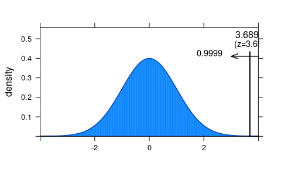
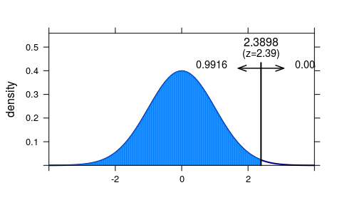
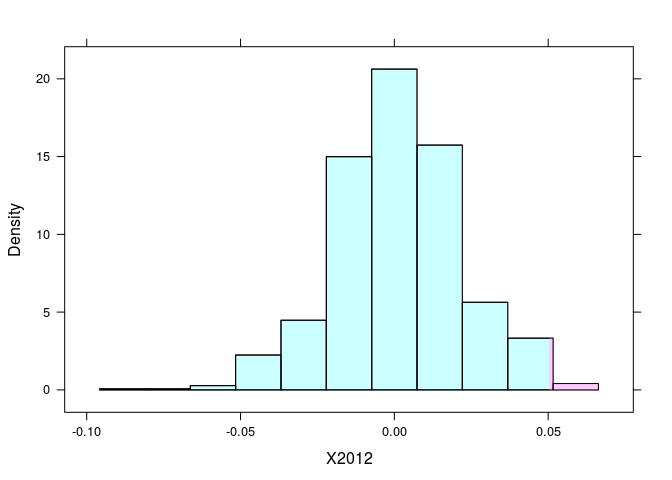

Einführung Inferenz kategoriale Werte
================
Karsten Lübke

Globaler Index der Religiösität und Atheismus
---------------------------------------------

Im Jahre 2012 führte das [WIN/Gallup International Institut](http://www.wingia.com/) in 57 Ländern eine Untersuchung zur Religiosität durch. Die Pressemitteilung zur Studie finden Sie [hier](http://www.wingia.com/web/files/richeditor/filemanager/Global_INDEX_of_Religiosity_and_Atheism_PR__6.pdf).

Dabei wurde die Frage gestellt: *Unabhängig davon, ob Sie an Gottesdiensten teilnehmen oder nicht ("attend place of worship"), würden Sie sagen, dass Sie ein religiöser Mensch sind, eine nicht religiöse Person oder ein überzeugter Atheist?*

Die Befragten hatten dabei drei Antwortmöglichkeiten: Religiöser Mensch ("A religious person"), Nicht religiöser Mensch ("Not a religious person"), und Atheist ("A convinced atheist"). Die Befragten klassifizierten sich, es wurden als kategorielle (nominale) Daten (`factor`) erzeugt.

------------------------------------------------------------------------

**Übung:**

1.  Handelt es sich bei den im Bereicht angegeben Kennzahlen um *Stichprobenstatistiken* oder um *Populationsparameter*?
2.  Um die Ergebnisse der Studie zu verallgemeinern, also auf die Gesamtbevölkerung zu schließen, welche Annahmen müssen dafür erfüllt sein, und klingen diese hier plausibel erfüllt?

------------------------------------------------------------------------

Ein Teil der Daten kann direkt von OpenIntro als R Datensatz heruntergeladen werden, und anschließend in R eingelesen:

``` r
download.file("http://www.openintro.org/stat/data/atheism.RData", 
              destfile = "atheism.RData") # Herunterladen
load("atheism.RData") # Einlesen
```

Einen Überblick erhält man wie immer über:

``` r
str(atheism) # Datenstruktur
```

    ## 'data.frame':    88032 obs. of  3 variables:
    ##  $ nationality: Factor w/ 57 levels "Afghanistan",..: 1 1 1 1 1 1 1 1 1 1 ...
    ##  $ response   : Factor w/ 2 levels "atheist","non-atheist": 2 2 2 2 2 2 2 2 2 2 ...
    ##  $ year       : int  2012 2012 2012 2012 2012 2012 2012 2012 2012 2012 ...

``` r
head(atheism) # Erste Beobachtungen
```

    ##   nationality    response year
    ## 1 Afghanistan non-atheist 2012
    ## 2 Afghanistan non-atheist 2012
    ## 3 Afghanistan non-atheist 2012
    ## 4 Afghanistan non-atheist 2012
    ## 5 Afghanistan non-atheist 2012
    ## 6 Afghanistan non-atheist 2012

``` r
tail(atheism) # letzte Beobachtungen
```

    ##       nationality    response year
    ## 88027     Vietnam non-atheist 2005
    ## 88028     Vietnam non-atheist 2005
    ## 88029     Vietnam non-atheist 2005
    ## 88030     Vietnam non-atheist 2005
    ## 88031     Vietnam non-atheist 2005
    ## 88032     Vietnam non-atheist 2005

Zur Analyse wird wieder das Paket mosaic verwendet:

``` r
require(mosaic)
```

Inferenz eines Anteilswerts
---------------------------

In Tabelle 6 der Pressemitteilung wird der Anteil der Atheisten für Deutschland mit 15% angegeben. Dies ist eine *Statistik* der Stichprobe, nicht der Parameter der *Population*. Es wird also die Frage beantwortet "Wie hoch ist der Anteil der Atheisten in der Stichprobe?". Um die Frage "Wie hoch ist der Anteil der Atheisten in der Population?" zu beantworten, muss von der Stichprobe auf die Population geschlossen werden, d. h. es wird z. B. der Anteilswert *geschätzt*.

Der folgende Befehl reduziert den Datensatz auf das Ergebnis für Deutschland im Jahr 2012:

``` r
de12 <- subset(atheism, nationality == "Germany" & year == "2012")
```

Die *Punktschätzung* des Anteilswertes der Atheisten für Deutschland im Jahr 2012 liegt dann bei

``` r
pdach <- tally(~response, data=de12, format='proportion')["atheist"]
pdach
```

    ##   atheist 
    ## 0.1494024

also bei 15%.

Um jetzt ein 95% Konfidenzintervall für den Populationsparameter zu konstruieren (*Bereichsschätzung*) muss der Standardfehler se bestimmt werden, hier:

``` r
n <- nrow(de12) # Anzahl Beobachtungen
se <- sqrt( pdach * (1-pdach) / n)
se
```

    ##    atheist 
    ## 0.01591069

Der Standardfehler, d. h. die Standardabweichung des Anteilswertes liegt hier also bei 1.59%. Zusammen mit dem 2,5% und 97,5% Quantil der Standardnormalverteilung ergibt sich folgendes Konfidenzintervall:

``` r
pdach + qnorm(c(0.025, 0.975)) * se
```

    ## [1] 0.1182180 0.1805868

Da der Populationsparameter unbekannt aber nicht zufällig ist, spricht man bei den 95% auch von einer *Überdeckungswahrscheinlichkeit*.

------------------------------------------------------------------------

**Übung:**

1.  Bei annähernd gleicher Stichprobengröße liegt der Anteil der Atheisten in Saudi Arabien bei 5%. Wie verändert sich der Standardfehler und damit die Breite des Konfidenzintervalls?
2.  Der Anteil der Atheisten in Südkorea liegt in etwas ebenfalls bei 15%, allerdings liegen die Daten von 1523 Befragten vor. Wie verändert sich der Standardfehler und damit die Breite des Konfidenzintervalls?

------------------------------------------------------------------------

Um für Deutschland die Nullhypothese: "Der Anteil der Atheisten liegt nicht über 10%" gegen die Alternativhypothese (Forschungshypothese) "Der Anteil der Atheisten liegt über 10%" können entweder wieder Simulations- und Resamplingtechniken verwendet werden, oder die Approximation durch die Normalverteilung:

``` r
z <- (pdach - 0.10) / se
xpnorm(z, lower.tail = FALSE)
```

    ## 
    ## If X ~ N(0,1), then 
    ## 
    ##  P(X <= 3.10498116589993) = P(Z <= 3.105) = 0.999
    ##  P(X >  3.10498116589993) = P(Z >  3.105) = 0.001



    ##      atheist 
    ## 0.0009514557

Der *p-Wert* liegt also bei 0.0951%, die Nullhypothese wird also zum Signifikanzniveau von 5% verworfen.

Differenz zweier Anteilswerte
-----------------------------

In den Daten liegen außerdem die Ergebnisse aus 2005 vor:

``` r
de05 <- subset(atheism, nationality == "Germany" & year == "2005")
```

Im Jahre 2005 lag der Anteil der Atheisten in Deutschland bei

``` r
tally(~response, data=de05, format="proportion")
```

    ## 
    ##     atheist non-atheist 
    ##  0.09960159  0.90039841

Der Aneil lag also bei unter 10% -- in der *Stichprobe*! Können wir daraus auf eine Veränderung in der *Population* schließen?

``` r
# 2012
a12 <- tally(~response, data=de12)["atheist"]
n12 <- nrow(de12)
p12 <- a12/n12
# 2015 
a05 <- tally(~response, data=de05)["atheist"]
n05 <- nrow(de05)
p05 <- a05/n05
# Schätzer Differenz
pdiff <- p12-p05
pdiff
```

    ##   atheist 
    ## 0.0498008

``` r
# Pooling
ppool <- (a12 + a05)/(n12+n05)
ppool
```

    ##  atheist 
    ## 0.124502

``` r
# se
se <- sqrt( (ppool * (1-ppool) / n12) + (ppool * (1-ppool) / n05) )
se
```

    ##   atheist 
    ## 0.0208391

``` r
# z
z <- (pdiff - 0)/se
# p-Wert
xpnorm(z, lower.tail = FALSE)
```

    ## 
    ## If X ~ N(0,1), then 
    ## 
    ##  P(X <= 2.38977724220256) = P(Z <= 2.39) = 0.9916
    ##  P(X >  2.38977724220256) = P(Z >  2.39) = 0.0084



    ##     atheist 
    ## 0.008429297

Der p-Wert ist kein, die Wahrscheinlichkeit *zufällig* eine solche Differenz der Anteilswerte zu beobachten also sehr, d. h. es wird auf eine *signifikante* Änderung des Anteilswertes in der *Population* geschlossen.

*Exkurs:* Mit dem Paket mosaic kann man das auch einfach über Permutationen testen, indem das Erhebungsjahr zufällig gesampelt wird:

``` r
# Gemeinsamer Datensatz
de <- subset(atheism, nationality == "Germany")
# Beobachtete Differenz
pdiff <- diff(tally(response~year, data=de, format="proportion")["atheist",])
pdiff
```

    ##      2012 
    ## 0.0498008

``` r
# Zufallszahlengenerator setzen (Reproduzierbarkeit!)
set.seed(1896)
# 1000-mal das Jahr permutieren: Nullhypothese kein Unterschied
pdiff.null <- do(1000) * diff(tally(response~sample(year), data=de, 
                                    format="proportion")["atheist",])
# Histogramm
histogram(~ X2012, groups=(X2012 >= pdiff), data=pdiff.null)
```



------------------------------------------------------------------------

**Übung:**

1.  Überprüfen Sie für das Jahr 2012, ob es eine zum Niveau 5% signifikante Differenz zwischen den Anteil der Atheisten in Deutschland und den Niederlanden (`Netherlands`) in der Population gibt.
2.  Überprüfen Sie für das Jahr 2016, ob es eine zum Niveau 5% signifikante Differenz zwischen den Anteil der Atheisten in Deutschland und Polen (`Poland`) in der Population gibt.

------------------------------------------------------------------------

Chi-Quadrat Unabhängigkeitstest
-------------------------------

Soll allgemein der Zusammenhang zwischen zwei kategoriellen (nominalen) Variablen untersucht werden, wird der Chi² Unabhängigkeitstest verwendet. Diese testet die Nullhypothese der Unabhängigkeit, gegen die Alternativhypothese des Zusammenhangs. Im vorliegenden Datensatz können wir z. B. testen, ob die Verteilung (Anteil) der Atheisten in den teilnehmenden G7 Ländern gleich ist:

``` r
G7 <- c("United States", "Canada", "Germany", "France", "Italy", "Japan")
G7.12 <- subset(atheism, nationality %in% G7 & year == 2012)
G7.12 <- droplevels(G7.12)
G7atheist <- tally(response ~ nationality, data = G7.12)
G7atheist
```

    ##              nationality
    ## response      Canada France Germany Italy Japan United States
    ##   atheist         90    485      75    79   372            50
    ##   non-atheist    912   1203     427   908   840           952

(Der Befehl `droplevels` sorgt dafür, dass die nicht mehr benötigten Ausprägungen der kategoriellen Variablen (`factor`) eingestellt werden.)

Der Test selber erfolgt in mosaic über \`xchisq.test', d. h.:

``` r
xchisq.test(G7atheist)
```

    ## 
    ##  Pearson's Chi-squared test
    ## 
    ## data:  x
    ## X-squared = 504.04, df = 5, p-value < 2.2e-16
    ## 
    ##     90      485       75       79      372       50  
    ## ( 180.40) ( 303.91) (  90.38) ( 177.70) ( 218.21) ( 180.40)
    ## [ 45.30] [107.91] [  2.62] [ 54.82] [108.39] [ 94.26]
    ## <-6.73>  <10.39>  <-1.62>  <-7.40>  <10.41>  <-9.71> 
    ##            
    ##    912     1203      427      908      840      952  
    ## ( 821.60) (1384.09) ( 411.62) ( 809.30) ( 993.79) ( 821.60)
    ## [  9.95] [ 23.69] [  0.57] [ 12.04] [ 23.80] [ 20.70]
    ## < 3.15>  <-4.87>  < 0.76>  < 3.47>  <-4.88>  < 4.55> 
    ##            
    ## key:
    ##  observed
    ##  (expected)
    ##  [contribution to X-squared]
    ##  <residual>

Der Wert der Teststatistik Chi² liegt bei 504.043463, die Anzahl der Freiheitsgrade ("degrees of freedom", df) bei 5, der p-Wert ist sehr klein, die Nullhypothese der Unabhängigkeit von Nationalität und Verteilung Atheismus wird für die *Population* verworfen.

Mit diesen Daten kann auch über den Befehl `pchisq` der p-Wert berechnet werden:

``` r
pchisq(504, 5, lower.tail = FALSE)
```

    ## [1] 1.093548e-106

Übung:
------

folgt

------------------------------------------------------------------------

Diese Übung basiert teilweise auf Übungen zum Buch [OpenIntro](https://www.openintro.org/stat/index.php?stat_book=isrs) von Andrew Bray und Mine Çetinkaya-Rundel unter der Lizenz [Creative Commons Attribution-ShareAlike 3.0 Unported](http://creativecommons.org/licenses/by-sa/3.0).

### Versionshinweise:

-   Datum erstellt: 2016-06-01
-   R Version: 3.3.0
-   `mosaic` Version: 0.13.0
