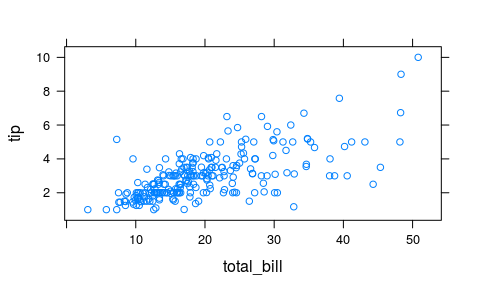
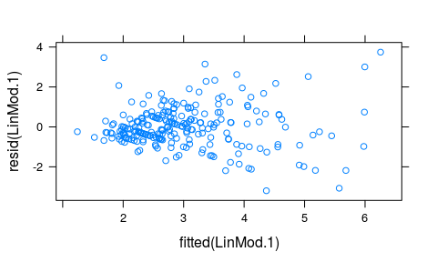
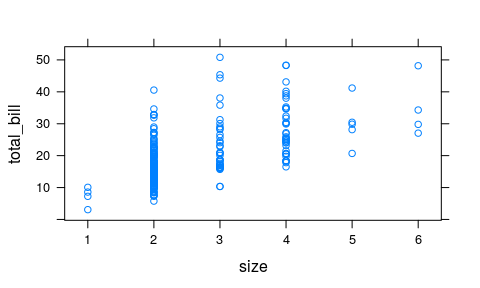
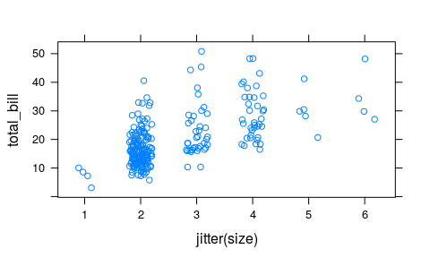
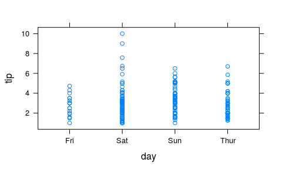

Einführung Lineare Regression
================
Karsten Lübke

Einfache Regression
-------------------

Wir werden weiter den *tips* Datensatz aus *Bryant, P. G. and Smith, M (1995) Practical Data Analysis: Case Studies in Business Statistics. Homewood, IL: Richard D. Irwin Publishing* analysieren.

Sofern noch nicht geschehen, können Sie in [hier](https://goo.gl/whKjnl) als `csv`-Datei herunterladen:

``` r
download.file("https://goo.gl/whKjnl", destfile = "tips.csv")
```

Das Einlesen erfolgt, sofern die Daten im Arbeitsverzeichnis liegen, über:

``` r
tips <- read.csv2("tips.csv")
```

Zur Unterstützung der Analyse wird (wieder) mosaic verwendet:

``` r
require(mosaic)
```

Wie hängen Trinkgeldhöhe `tip` und Rechnungshöhe `total_bill` zusammen? Kann die Höhe des Trinkgeldes als *lineare* Funktion der Rechnungshöhe modelliert werden?

Zunächst eine visuelle Analyse mi Hilfe eines Scatterplots.

``` r
xyplot(tip ~ total_bill, data=tips)
```



Es scheint einen positiven Zusammenhang zu geben. Modellieren wir die Abhängige Variable `tip` (inhaltliche Entscheidung!) als lineare Funktion der Unabhängigen Variable `total_bill`:

``` r
LinMod.1 <- lm(tip ~ total_bill, data=tips)
summary(LinMod.1)
```

    ## 
    ## Call:
    ## lm(formula = tip ~ total_bill, data = tips)
    ## 
    ## Residuals:
    ##     Min      1Q  Median      3Q     Max 
    ## -3.1982 -0.5652 -0.0974  0.4863  3.7434 
    ## 
    ## Coefficients:
    ##             Estimate Std. Error t value Pr(>|t|)    
    ## (Intercept) 0.920270   0.159735   5.761 2.53e-08 ***
    ## total_bill  0.105025   0.007365  14.260  < 2e-16 ***
    ## ---
    ## Signif. codes:  0 '***' 0.001 '**' 0.01 '*' 0.05 '.' 0.1 ' ' 1
    ## 
    ## Residual standard error: 1.022 on 242 degrees of freedom
    ## Multiple R-squared:  0.4566, Adjusted R-squared:  0.4544 
    ## F-statistic: 203.4 on 1 and 242 DF,  p-value: < 2.2e-16

Der Achsenabschnitt (`intercept`) wird mit 0.92 geschätzt, die Steigung in Richtung `total_bill` mit 0.11: steigt `total_bill` um einen Dollar, steigt im *Durchschnitt* `tip` um 0.11. Die Prognose für `tip` lautet also

`tip` = 0.92 + 0.11 \* `total_bill`

In mosaic kann ein solches Modell einfach als neue Funktion definiert werden:

``` r
LinMod.1Fun <- makeFun(LinMod.1)
```

Die (Punkt-)Prognose für die Trinkgeldhöhe, bspw. für eine Rechnung von 30$ kann dann berechnet werden

``` r
LinMod.1Fun(total_bill=30)
```

    ##        1 
    ## 4.071005

also 4.07$.

In mosaic kann die Modellgerade über

``` r
plotModel(LinMod.1)
```


betrachtet werden. Das Bestimmtheitsmaß R² ist mit 0.46 ok: 46-% der Variation des Trinkgeldes wird im Modell erklärt.

Aber wie sieht es mit den Annahmen aus?

-   Die Linearität des Zusammenhangs haben wir zu Beginn mit Hilfe des Scatterplots "überprüft"
-   Zur Überprüfung der Normalverteilung der Residuen zeichnen wir ein Histogramm. Die Residuen können über den Befehl `resid()` aus einem Linearen Modell extrahiert werden. Hier scheint es zu passen:

``` r
histogram( ~ resid(LinMod.1))
```


-   Konstante Varianz: Dies kann z. B. mit einem Scatterplot der Residuen auf der y-Achse und den angepassten Werten auf der x-Achse überprüft werden. Die angepassten Werte werden über den Befehl `fitted()` extrahiert. Diese Annahme scheint verletzt zu sein (siehe unten): je größer die Prognose des Trinkgeldes, desto größer wirkt die Streuung der Residuen. Dieses Phänomen ließ sich schon aus dem ursprünglichen Scatterplot `xyplot(tip ~ total_bill, data=tips)` erahnen. Das ist auch inhaltich plausibel: je höher die Rechnung, desto höher die Varianz beim Trinkgeld. Die Verletzung dieser Annahme beeinflusst *nicht* die Schätzung der Steigung, sondern die Schätzung des Standardfehlers, also des p-Wertes des Hypothesentests, z. B. "Steigung=0".

``` r
xyplot(resid(LinMod.1) ~ fitted(LinMod.1))
```



-   Extreme Ausreißer: Wie am Plot der Linearen Regression `plotModel(LinMod.1)` erkennbar gibt es vereinzelt Ausreißer nach oben, allerdings ohne einen extremen Hebel.

Hängt die Rechnungshöhe von der Anzahl der Personen ab? Bestimmt, aber wie?

``` r
xyplot(total_bill ~ size, data=tips)
```



Da bei diskreten metrischen Variablen (hier `size`) Punkte übereinanderliegen können, sollte man "jittern", d. h. eine (kleine) Zufallszahl addieren:

``` r
set.seed(1896) # Zufallszahlengenerater setzen
xyplot(total_bill ~ jitter(size), data=tips)
```



Regression mit kategorialen Werten
----------------------------------

Der Wochentag `day` ist eine kategoriale Variable. Wie sieht eine Regression des Trinkgeldes darauf aus?

Zunächst grafisch:

``` r
xyplot(tip ~ day, data=tips)
```



Und als Lineares Modell:

``` r
LinMod.2 <- lm(tip ~ day, data=tips)
summary(LinMod.2)
```

    ## 
    ## Call:
    ## lm(formula = tip ~ day, data = tips)
    ## 
    ## Residuals:
    ##     Min      1Q  Median      3Q     Max 
    ## -2.2451 -0.9931 -0.2347  0.5382  7.0069 
    ## 
    ## Coefficients:
    ##             Estimate Std. Error t value Pr(>|t|)    
    ## (Intercept)  2.73474    0.31612   8.651 7.46e-16 ***
    ## daySat       0.25837    0.34893   0.740    0.460    
    ## daySun       0.52039    0.35343   1.472    0.142    
    ## dayThur      0.03671    0.36132   0.102    0.919    
    ## ---
    ## Signif. codes:  0 '***' 0.001 '**' 0.01 '*' 0.05 '.' 0.1 ' ' 1
    ## 
    ## Residual standard error: 1.378 on 240 degrees of freedom
    ## Multiple R-squared:  0.02048,    Adjusted R-squared:  0.008232 
    ## F-statistic: 1.672 on 3 and 240 DF,  p-value: 0.1736

Die im Modell angegebenen Schätzwerte sind die Änderung der Trinkgeldprognose, wenn z. B. der Tag ein Samstag (`daySat`) im Vergleich zu einer Referenzkategorie. Dies ist in R das erste Element des Vektors der Faktorlevel. Welcher dies ist ist über den Befehl `levels()` zu erfahren

``` r
levels(tips$day)
```

    ## [1] "Fri"  "Sat"  "Sun"  "Thur"

hier also Fri (aufgrund der standardmäßig aufsteigenden alphanumerischen Sortierung). Dies kann über `relevel()` geändert werden. Soll z. B. die Referenz der Donnerstag, `Thur` sein:

``` r
tips$day <- relevel(tips$day, ref = "Thur")
levels(tips$day)
```

    ## [1] "Thur" "Fri"  "Sat"  "Sun"

Das Modell ändert sich entsprechend:

``` r
LinMod.3 <- lm(tip ~ day, data=tips)
summary(LinMod.3)
```

    ## 
    ## Call:
    ## lm(formula = tip ~ day, data = tips)
    ## 
    ## Residuals:
    ##     Min      1Q  Median      3Q     Max 
    ## -2.2451 -0.9931 -0.2347  0.5382  7.0069 
    ## 
    ## Coefficients:
    ##             Estimate Std. Error t value Pr(>|t|)    
    ## (Intercept)  2.77145    0.17500  15.837   <2e-16 ***
    ## dayFri      -0.03671    0.36132  -0.102   0.9191    
    ## daySat       0.22165    0.22902   0.968   0.3341    
    ## daySun       0.48368    0.23581   2.051   0.0413 *  
    ## ---
    ## Signif. codes:  0 '***' 0.001 '**' 0.01 '*' 0.05 '.' 0.1 ' ' 1
    ## 
    ## Residual standard error: 1.378 on 240 degrees of freedom
    ## Multiple R-squared:  0.02048,    Adjusted R-squared:  0.008232 
    ## F-statistic: 1.672 on 3 and 240 DF,  p-value: 0.1736

sowie als Plot:

``` r
plotModel(LinMod.3)
```


Die (Punkt-)Prognose für die Trinkgeldhöhe, bspw. an einen Freitag kann dann berechnet werden

``` r
LinMod.3Fun <- makeFun(LinMod.3)
LinMod.3Fun(day="Fri")
```

    ##        1 
    ## 2.734737

Multivariate Regression
-----------------------

Aber wie wirken sich die Einflussgrößen *zusammen* auf das Trinkgeld aus?

``` r
LinMod.4 <- lm(tip ~ total_bill + size + sex  + smoker + day + time, data=tips)
summary(LinMod.4)
```

    ## 
    ## Call:
    ## lm(formula = tip ~ total_bill + size + sex + smoker + day + time, 
    ##     data = tips)
    ## 
    ## Residuals:
    ##     Min      1Q  Median      3Q     Max 
    ## -2.8475 -0.5729 -0.1026  0.4756  4.1076 
    ## 
    ## Coefficients:
    ##              Estimate Std. Error t value Pr(>|t|)    
    ## (Intercept)  0.641558   0.497586   1.289   0.1985    
    ## total_bill   0.094487   0.009601   9.841   <2e-16 ***
    ## size         0.175992   0.089528   1.966   0.0505 .  
    ## sexMale     -0.032441   0.141612  -0.229   0.8190    
    ## smokerYes   -0.086408   0.146587  -0.589   0.5561    
    ## dayFri       0.162259   0.393405   0.412   0.6804    
    ## daySat       0.040801   0.470604   0.087   0.9310    
    ## daySun       0.136779   0.471696   0.290   0.7721    
    ## timeLunch    0.068129   0.444617   0.153   0.8783    
    ## ---
    ## Signif. codes:  0 '***' 0.001 '**' 0.01 '*' 0.05 '.' 0.1 ' ' 1
    ## 
    ## Residual standard error: 1.024 on 235 degrees of freedom
    ## Multiple R-squared:  0.4701, Adjusted R-squared:  0.452 
    ## F-statistic: 26.06 on 8 and 235 DF,  p-value: < 2.2e-16

Interessant sind die negativen Vorzeichen vor den Schätzwerten für `sexMale` und `smokerYes` -- anscheinend geben Männer und Raucher weniger Trinkgeld, wenn alle anderen Faktoren konstant bleiben. Bei einer rein univariaten Betrachtung wäre etwas anderes herausgekommen.

``` r
summary(lm(tip ~ sex, data=tips))
```

    ## 
    ## Call:
    ## lm(formula = tip ~ sex, data = tips)
    ## 
    ## Residuals:
    ##     Min      1Q  Median      3Q     Max 
    ## -2.0896 -1.0896 -0.0896  0.6666  6.9104 
    ## 
    ## Coefficients:
    ##             Estimate Std. Error t value Pr(>|t|)    
    ## (Intercept)   2.8334     0.1481  19.137   <2e-16 ***
    ## sexMale       0.2562     0.1846   1.388    0.166    
    ## ---
    ## Signif. codes:  0 '***' 0.001 '**' 0.01 '*' 0.05 '.' 0.1 ' ' 1
    ## 
    ## Residual standard error: 1.381 on 242 degrees of freedom
    ## Multiple R-squared:  0.007896,   Adjusted R-squared:  0.003797 
    ## F-statistic: 1.926 on 1 and 242 DF,  p-value: 0.1665

``` r
summary(lm(tip ~ smoker, data=tips))
```

    ## 
    ## Call:
    ## lm(formula = tip ~ smoker, data = tips)
    ## 
    ## Residuals:
    ##     Min      1Q  Median      3Q     Max 
    ## -2.0087 -0.9936 -0.1003  0.5580  6.9913 
    ## 
    ## Coefficients:
    ##             Estimate Std. Error t value Pr(>|t|)    
    ## (Intercept)  2.99185    0.11283  26.517   <2e-16 ***
    ## smokerYes    0.01686    0.18276   0.092    0.927    
    ## ---
    ## Signif. codes:  0 '***' 0.001 '**' 0.01 '*' 0.05 '.' 0.1 ' ' 1
    ## 
    ## Residual standard error: 1.386 on 242 degrees of freedom
    ## Multiple R-squared:  3.515e-05,  Adjusted R-squared:  -0.004097 
    ## F-statistic: 0.008506 on 1 and 242 DF,  p-value: 0.9266

Diese *Umkehrung* des modellierten Effektes liegt daran, dass es auch einen positiven Zusammenhang zur Rechnungshöhe gibt:

``` r
summary(lm(total_bill ~ sex, data=tips))
```

    ## 
    ## Call:
    ## lm(formula = total_bill ~ sex, data = tips)
    ## 
    ## Residuals:
    ##    Min     1Q Median     3Q    Max 
    ## -14.99  -6.02  -1.94   3.99  30.07 
    ## 
    ## Coefficients:
    ##             Estimate Std. Error t value Pr(>|t|)    
    ## (Intercept)  18.0569     0.9463  19.081   <2e-16 ***
    ## sexMale       2.6872     1.1797   2.278   0.0236 *  
    ## ---
    ## Signif. codes:  0 '***' 0.001 '**' 0.01 '*' 0.05 '.' 0.1 ' ' 1
    ## 
    ## Residual standard error: 8.827 on 242 degrees of freedom
    ## Multiple R-squared:  0.02099,    Adjusted R-squared:  0.01694 
    ## F-statistic: 5.188 on 1 and 242 DF,  p-value: 0.02361

``` r
summary(lm(total_bill ~ smoker, data=tips))
```

    ## 
    ## Call:
    ## lm(formula = total_bill ~ smoker, data = tips)
    ## 
    ## Residuals:
    ##     Min      1Q  Median      3Q     Max 
    ## -17.686  -6.459  -1.888   4.583  30.054 
    ## 
    ## Coefficients:
    ##             Estimate Std. Error t value Pr(>|t|)    
    ## (Intercept)  19.1883     0.7233  26.529   <2e-16 ***
    ## smokerYes     1.5681     1.1716   1.338    0.182    
    ## ---
    ## Signif. codes:  0 '***' 0.001 '**' 0.01 '*' 0.05 '.' 0.1 ' ' 1
    ## 
    ## Residual standard error: 8.888 on 242 degrees of freedom
    ## Multiple R-squared:  0.007348,   Adjusted R-squared:  0.003246 
    ## F-statistic: 1.791 on 1 and 242 DF,  p-value: 0.182

Im vollem Modell `LinMod.4` sind alle unabhängigen Variablen berücksichtigt, die Koeffizienten beziehen sich dann immer auf: gegeben die anderen Variablen bleiben konstant.

Vergleichen wir mal zwei Modelle:

``` r
LinMod.5a <- lm(tip ~  sex, data=tips)
coef(LinMod.5a) # Koeffizienten extrahieren
```

    ## (Intercept)     sexMale 
    ##   2.8334483   0.2561696

``` r
LinMod.5b <- lm(tip ~  sex + total_bill, data=tips)
coef(LinMod.5b) # Koeffizienten extrahieren
```

    ## (Intercept)     sexMale  total_bill 
    ##  0.93327849 -0.02660871  0.10523236

Ohne die Berücksichtigung der **Kovariable** Rechnungshöhe geben Male ein um im Durchschnitt 0.26$ *höheres* Trinkgeld, bei Kontrolle, d. h. gleicher Rechnungshöhe ein um 0.03$ *niedrigeres* Trinkgeld als die Referenzklasse Female (`levels(tips$sex)[1]`).

Inferenz in der linearen Regression
-----------------------------------

Kehren wir noch einmal zur multivariaten Regression (`LinMod.4`) zurück.

``` r
summary(LinMod.4)
```

    ## 
    ## Call:
    ## lm(formula = tip ~ total_bill + size + sex + smoker + day + time, 
    ##     data = tips)
    ## 
    ## Residuals:
    ##     Min      1Q  Median      3Q     Max 
    ## -2.8475 -0.5729 -0.1026  0.4756  4.1076 
    ## 
    ## Coefficients:
    ##              Estimate Std. Error t value Pr(>|t|)    
    ## (Intercept)  0.641558   0.497586   1.289   0.1985    
    ## total_bill   0.094487   0.009601   9.841   <2e-16 ***
    ## size         0.175992   0.089528   1.966   0.0505 .  
    ## sexMale     -0.032441   0.141612  -0.229   0.8190    
    ## smokerYes   -0.086408   0.146587  -0.589   0.5561    
    ## dayFri       0.162259   0.393405   0.412   0.6804    
    ## daySat       0.040801   0.470604   0.087   0.9310    
    ## daySun       0.136779   0.471696   0.290   0.7721    
    ## timeLunch    0.068129   0.444617   0.153   0.8783    
    ## ---
    ## Signif. codes:  0 '***' 0.001 '**' 0.01 '*' 0.05 '.' 0.1 ' ' 1
    ## 
    ## Residual standard error: 1.024 on 235 degrees of freedom
    ## Multiple R-squared:  0.4701, Adjusted R-squared:  0.452 
    ## F-statistic: 26.06 on 8 and 235 DF,  p-value: < 2.2e-16

In der 4. Spalte der, mit Zeilennamen versehen Tabelle `Coefficients` stehen die p-Werte der Nullhypothese, die unabhängige Variable hat, gegeben alle anderen Variablen im Modell, keinen linearen Einfluss auf die abhängige Variable. Zur Bestimmung des p-Wertes wird der Schätzer (`Estimate`) durch den Standardfehler (`Std. Error`) dividiert. Der resultierende t-Wert (`t value`) wird dann, zusammen mit der Anzahl an Freiheitsgraden zur Berechnung des p-Wertes (`Pr(>|t|)`) verwendet. Zur schnelleren Übersicht finden sich dahinter "Sternchen" und "Punkte", die die entsprechenden Signifikanzniveaus symbolisieren: `***` bedeutet eine Irrtumswahrscheinlichkeit, Wahrscheinlichkeit für Fehler 1. Art, von unter 0.001, d. h. unter 0,1%. `**` entsprechend 1%, `*` 5% und `.` 10%. Zum Signifikanzniveau von 10% sind hier also zwei Faktoren und der Achsenabschnitt (`(Intercept)`) signifikant -- nicht notwendigerweise relevant: Rechnungshöhe `total_bill` sowie Anzahl Personen `size`. Beides wirkt sich linear positiv auf die Trinkgeldhöhe aus: Mit jedem Dollar Rechnungshöhe steigt im Mittelwert die Trinkgeldhöhe um 0.09 Dollar, mit jeder Person um 0.18 Dollar -- gegeben alle anderen Faktoren bleiben konstant. Das Bestimmtheitsmaß R² (`Multiple R-squared:`) liegt bei 0.47, also 47-% der Variation des Trinkgeldes wird im Modell erklärt.

Modellwahl
----------

Das Modell mit allen Variablen des Datensatzes, d. h. mit 6 unabhängigen (`LinMod.4`) erklärt 47.01-% der Variation, das Modell *nur* mit der Rechnungshöhe als erklärende Variable (`LinMod.1`) schon 45.66%, der Erklärungszuwachs liegt also gerade einmal bei 1.35 Prozentpunkten. In der Statistik ist die Wahl des *richtigen* Modell eine der größten Herausforderungen, auch deshalb weil man der wahre Modell in der Regel nicht kennt und es schwer ist die richtige Balance zwischen Einfachheit und Komplexität zu finden. Aufgrund des Zufalls kann es immer passieren, dass das Modell sich zu sehr an die *zufälligen* Daten anpasst (Stichwort: Overfitting). Es gibt unzählige Modellwahlmethoden, und leider garantiert keine, dass man immer das beste Modell findet. Eine Möglichkeit ist die sogenannte Schrittweise-Rückwärtsselektion auf Basis des Akaike-Informationskriteriums (AIC). Diese ist nicht nur recht weit verbreitet - und liefert unter bestimmten Annahmen das "richtige" Modell - sondern in R durch den Befehl `step()` einfach umsetzbar:

``` r
step(LinMod.4)
```

    ## Start:  AIC=20.51
    ## tip ~ total_bill + size + sex + smoker + day + time
    ## 
    ##              Df Sum of Sq    RSS     AIC
    ## - day         3     0.609 247.14  15.116
    ## - time        1     0.025 246.55  18.538
    ## - sex         1     0.055 246.58  18.568
    ## - smoker      1     0.365 246.89  18.874
    ## <none>                    246.53  20.513
    ## - size        1     4.054 250.58  22.493
    ## - total_bill  1   101.595 348.12 102.713
    ## 
    ## Step:  AIC=15.12
    ## tip ~ total_bill + size + sex + smoker + time
    ## 
    ##              Df Sum of Sq    RSS    AIC
    ## - time        1     0.001 247.14 13.117
    ## - sex         1     0.042 247.18 13.157
    ## - smoker      1     0.380 247.52 13.490
    ## <none>                    247.14 15.116
    ## - size        1     4.341 251.48 17.365
    ## - total_bill  1   101.726 348.86 97.232
    ## 
    ## Step:  AIC=13.12
    ## tip ~ total_bill + size + sex + smoker
    ## 
    ##              Df Sum of Sq    RSS    AIC
    ## - sex         1     0.041 247.18 11.157
    ## - smoker      1     0.379 247.52 11.491
    ## <none>                    247.14 13.117
    ## - size        1     4.342 251.48 15.366
    ## - total_bill  1   103.327 350.46 96.350
    ## 
    ## Step:  AIC=11.16
    ## tip ~ total_bill + size + smoker
    ## 
    ##              Df Sum of Sq    RSS    AIC
    ## - smoker      1     0.376 247.55  9.528
    ## <none>                    247.18 11.157
    ## - size        1     4.344 251.52 13.408
    ## - total_bill  1   104.263 351.44 95.029
    ## 
    ## Step:  AIC=9.53
    ## tip ~ total_bill + size
    ## 
    ##              Df Sum of Sq    RSS    AIC
    ## <none>                    247.55  9.528
    ## - size        1     5.235 252.79 12.634
    ## - total_bill  1   106.281 353.83 94.685

    ## 
    ## Call:
    ## lm(formula = tip ~ total_bill + size, data = tips)
    ## 
    ## Coefficients:
    ## (Intercept)   total_bill         size  
    ##     0.66894      0.09271      0.19260

In den letzten Zeilen der Ausgabe steht das beste Modell, dass diese Methode (schrittweise, rückwärts) mit diesem Kriterium (AIC) bei diesen Daten findet:

`tip =  0.66894 +  0.09271 * total_bill + 0.19260 * size`

Der Ausgabe kann man auch entnehmen, welche Variablen in welcher Reihenfolge *entfernt* wurden: Zunächst `day`, dann `time`, danach `sex` und schließlich `smoker`. Hier sind also dieselben Variablen noch im Modell, die auch in `LinMod.4` signifikant zum Niveau 10% waren, eine Auswahl der dort signifikanten Variablen hätte also dasselbe Modell ergeben. Das ist häufig so, aber nicht immer!

------------------------------------------------------------------------

Übung: Teaching Rating
----------------------

Dieser Datensatz analysiert u. a. den Zusammenhang zwischen Schönheit und Evaluierungsergebnis von Dozenten:

*Hamermesh, D.S., and Parker, A. (2005). Beauty in the Classroom: Instructors' Pulchritude and Putative Pedagogical Productivity. Economics of Education Review, 24, 369–376.*

Sie können ihn, sofern noch nicht geschehen, von <https://goo.gl/6Y3KoK> als `csv`herunterladen.

*folgt*

------------------------------------------------------------------------

Diese Übung basiert teilweise auf Übungen zum Buch [OpenIntro](https://www.openintro.org/stat/index.php?stat_book=isrs) von Andrew Bray und Mine Çetinkaya-Rundel unter der Lizenz [Creative Commons Attribution-ShareAlike 3.0 Unported](http://creativecommons.org/licenses/by-sa/3.0).

### Versionshinweise:

-   Datum erstellt: 2016-06-14
-   R Version: 3.3.0
-   `mosaic` Version: 0.13.0
